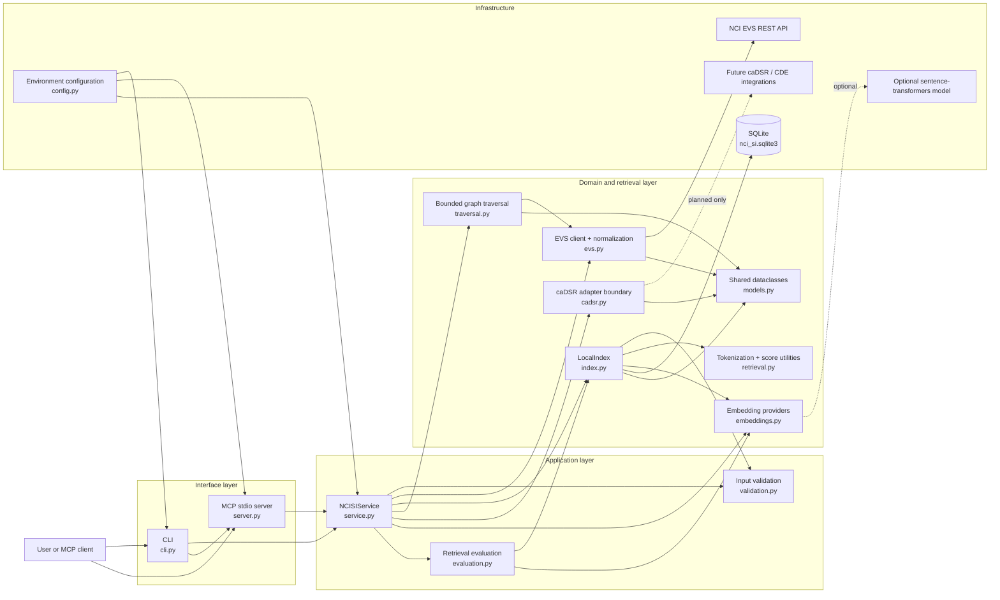
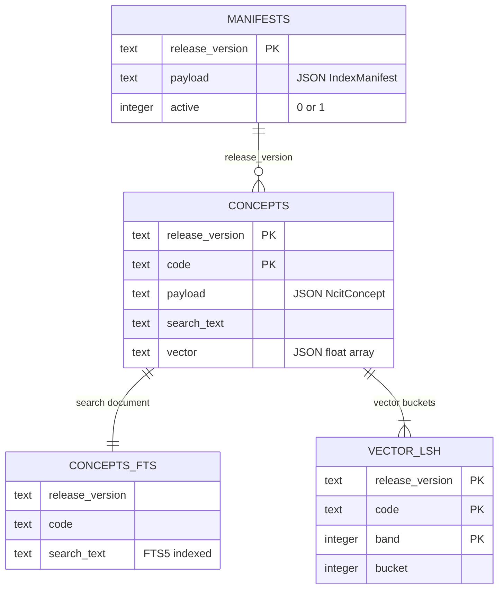

# NCI SI MCP Architecture

This document describes the repository as implemented. The project is an
EVS-first Python prototype that exposes NCI Thesaurus (NCIt) retrieval through
both a command-line interface and a local Model Context Protocol (MCP) server.

## Component schema

`errors.py` is used by every layer and is left out of the diagram. Also not
drawn: `index.py` calls the concept normalization in `evs.py`, and the two
adapters read the closed value sets in `validation.py` and the default limits
in `traversal.py`.

## Components

| Component | Responsibility | Main dependencies |
| --- | --- | --- |
| `cli.py` | Defines `serve`, release inspection, sample indexing, search, lookup, traversal, and evaluation commands; reports configuration and startup failures; exits 1 on an error envelope. | `NCISIService`, `server` |
| `server.py` | Registers five MCP tools and three MCP resource templates on an `mcp` 2.x `MCPServer` and flags error envelopes as protocol errors. | `NCISIService`, optional `mcp` package |
| `service.py` | Validates inputs, orchestrates the use cases, pins EVS requests to the monthly release, enforces release consistency with the index, falls back from live EVS to the cache in `lookup`, and maps expected failures to error envelopes. Its collaborators are injectable for testing. | EVS client, local index, traversal, embeddings, evaluation, caDSR adapter |
| `evs.py` | Calls EVS REST endpoints with bounded retries and response-size limits, classifies failures (unreachable, not found, unusable response), resolves exactly one latest monthly NCIt release, and normalizes EVS payloads. | Python `urllib`, shared models, NCI EVS API |
| `index.py` | Migrates and transactionally maintains the release manifest, normalized concepts, FTS search text, vectors, and vector LSH buckets; performs BM25/vector/hybrid search. | SQLite FTS5, retrieval utilities, embedding provider, `validation.py`, concept normalization in `evs.py` |
| `retrieval.py` | Implements tokenization, the dot product used as cosine similarity for unit vectors, and min-max normalization. | Python standard library |
| `embeddings.py` | Defines the embedding abstraction, a deterministic local hashing provider, an optional sentence-transformers provider, and the check that provider and model settings agree. | Optional `sentence-transformers` package |
| `traversal.py` | Resolves which edge types to follow and performs a breadth-first traversal of hierarchy, role, and association relations with deduplication and hard depth/node/edge limits. | EVS client, shared models |
| `models.py` | Defines serializable release, concept, index, search-hit, traversal, and caDSR status dataclasses. | Python standard library |
| `evaluation.py` | Evaluates BM25, vector, and hybrid retrieval against a small built-in gold-query set. | Local index, embedding provider |
| `cadsr.py` | Exposes an explicit `reuse_pending` boundary; no caDSR search or fabricated CDE results are implemented. | Shared models |
| `config.py` | Loads EVS, retry, batching, logging, data-directory, and embedding settings from environment variables and validates them; whether the data directory is usable shows only when the index is opened. | Environment, `embeddings.py` |
| `validation.py` | Defines the closed value sets (search modes, directions, edge types), normalizes NCIt codes, and validates search and traversal inputs. | Shared errors |
| `errors.py` | Defines the validation and index errors, the error codes, and the serialized error envelope. | Python standard library |

## Primary flows

### Build a local index

1. `index-sample` enters through the CLI and calls `NCISIService.index_codes`.
2. The service validates and deduplicates the codes, resolves the single latest
   monthly NCIt release, then retrieves the concepts from EVS in bounded
   batches, each request pinned to that release. If EVS does not return every
   code, nothing is indexed.
3. `LocalIndex` normalizes each concept and verifies the payload release and
   embedding provider/model/dimensions before changing persistent state.
4. Search text, embeddings, FTS rows, vector LSH buckets, and the manifest are
   committed in one SQLite transaction. Concepts of the release already indexed
   are added to it; concepts of another release replace the index. A failure
   leaves the previous index untouched.

### Search

1. CLI or MCP calls `NCISIService.search`.
2. `LocalIndex` verifies that the runtime embedding configuration matches the
   manifest.
3. BM25 candidates come from SQLite FTS5. For vector scores, a release of up to
   20,000 concepts is scanned exactly; a larger one is narrowed to at most 2,000
   candidates from the LSH buckets and the BM25 hits before scoring. Work for an
   unused retrieval mode is skipped.
4. Each component is min-max normalized over the concepts scored for the query
   and combined as BM25, vector, or a `0.55 * BM25 + 0.45 * vector` hybrid
   score. Scores order the hits of one query; they are not comparable across
   queries.
5. Ranked `SearchHit` objects are returned with raw EVS payloads hidden unless
   explicitly requested.

### Lookup

1. The service resolves the current monthly release. If the index holds a
   different release, lookup fails with `version_mismatch` unless `live_only` is
   set, so that lookups and searches never mix releases. With `live_only` the
   call does not read the index; the CLI still opens it at startup.
2. The concept is requested from live EVS, pinned to that release, and the
   release of the answer is verified. A code the release does not contain is
   `concept_not_found`.
3. If EVS cannot be reached, lookup returns the concept from the index unless
   `live_only` is set. The result then has `source: active_cache` and a
   `fallback` object with the reason. An ambiguous monthly release is not an
   outage: lookup fails with `release_unresolved` and does not use the cache.

### Traverse

1. Direction, the include flags, and `edge_types` select the edge types to
   follow. A combination that selects nothing, or names an edge type the
   direction excludes, is rejected before any request is made.
2. The service resolves the monthly release and calls `traverse_ncit`.
3. The walk is breadth-first, one depth at a time over all start codes, so
   nearer nodes claim the limits before farther ones. Each level is read with
   batched concept requests that include the selected relation lists, pinned to
   the release, and every fetched concept is checked against it. Requested
   limits are clamped to a maximum depth of 4, 1,000 nodes, and 5,000 edges.
4. `descendant` edges are followed only on request. They come from one EVS
   request per start code, pinned to the release and limited to `max_depth`
   levels, and each is emitted together with the other edges that reach the
   depth of its level. EVS gives a descendant one level, which can be deeper
   than its shortest path.
5. Edges are deduplicated, every emitted edge references emitted nodes, and the
   result reports whether a limit dropped anything. A concept whose relations
   or descendants exceed the EVS response-size limit is kept as a node, is not
   expanded, sets `truncated`, and is listed in `unexpanded_codes`.

## Persistence schema

SQLite holds one release: the concept cache and the search index over it. The
database does not declare a foreign key, but `release_version` is the logical
relationship between the tables. `PRAGMA user_version` drives migrations, and a
partial unique index guarantees that at most one manifest is active. Earlier
versions kept every release ever indexed; opening such a database (schema
version below 4) drops all rows except those of the active release. The LSH
layout (4 bands of 8 bits) and the hashing embedding are part of the stored
format.

A cached concept keeps the `retrieved_at` time at which it was fetched from EVS
for indexing.

## Public surface

MCP tools:

- `ncit_search`
- `ncit_lookup`
- `ncit_traverse`
- `ncit_release_info`
- `cadsr_status`

MCP resources:

- `nci-si://concept/ncit/{code}`
- `nci-si://release/ncit/{version}`
- `nci-si://index/ncit/{version}/manifest`

The CLI additionally exposes sample indexing and retrieval evaluation, which are
not MCP tools. The README lists the error codes.

## Current boundaries

- NCIt is the only implemented terminology path.
- Search is local and requires an index; the search endpoint of EVS is not
  used.
- Traversal is live against EVS rather than cached in SQLite. Inward walks are
  slower than outward ones because the inverse relations of hub concepts are
  megabytes each.
- Vector search is exact up to 20,000 indexed concepts. Beyond that it scores
  only LSH and BM25 candidates, and vector-only mode then misses most nearest
  neighbours. One measurement: a synthetic index of 3,000 concepts, each with a
  four-word name and a twelve-word definition, forced onto this path and
  queried with 100 of the names, returned the exact nearest neighbour for 17
  queries in vector mode and 87 in hybrid mode. The figure depends on how much
  of the indexed text a query repeats. A full-NCIt index would need a real ANN
  engine.
- caDSR/CDE discovery is a status-only adapter until reusable APIs, credentials,
  schemas, indexes, models, and ranking rules are confirmed.
- Indexing is manual by supplied codes; there is no complete NCIt-universe build
  workflow. An index cannot be
  re-embedded in place: changing the embedding settings means deleting the
  database file and indexing again.
- The MCP dependency requires Python 3.10+, while the core CLI and tests support
  Python 3.9+.

## Verification map

- `tests/test_evs.py`: monthly-release selection, release pinning, and concept provenance.
- `tests/test_evs_client.py`: retries and backoff, failure classification, response limits, payload shapes, and request URLs.
- `tests/test_index.py`: upserts and release replacement, rollback, embedding compatibility, migrations, and BM25/vector/hybrid search.
- `tests/test_service.py`: lookup (live, fallback, mismatch, not found), indexing, search, traversal, status, and the mapping of failures to error codes.
- `tests/test_traversal.py`: edge-type selection, batching, depth/node/edge limits, descendants, deduplication, and graph integrity.
- `tests/test_validation.py`: public input validation and embedding configuration.
- `tests/test_config.py`: environment parsing and settings validation.
- `tests/test_evaluation.py`: ranking metrics.
- `tests/test_cli.py`: argument parsing, command dispatch, exit codes, and startup failures.
- `tests/test_server.py`: tool and resource registration, results, and protocol-level errors over an in-process MCP session.
