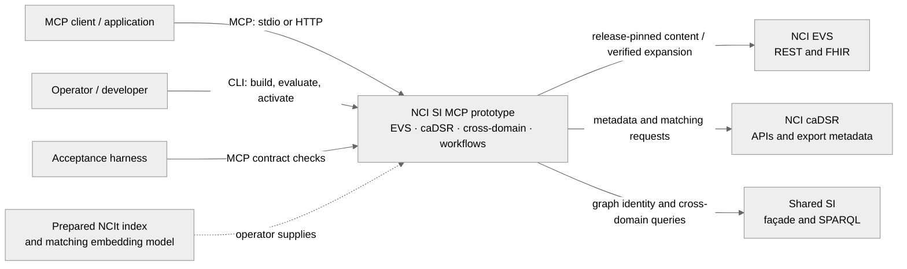
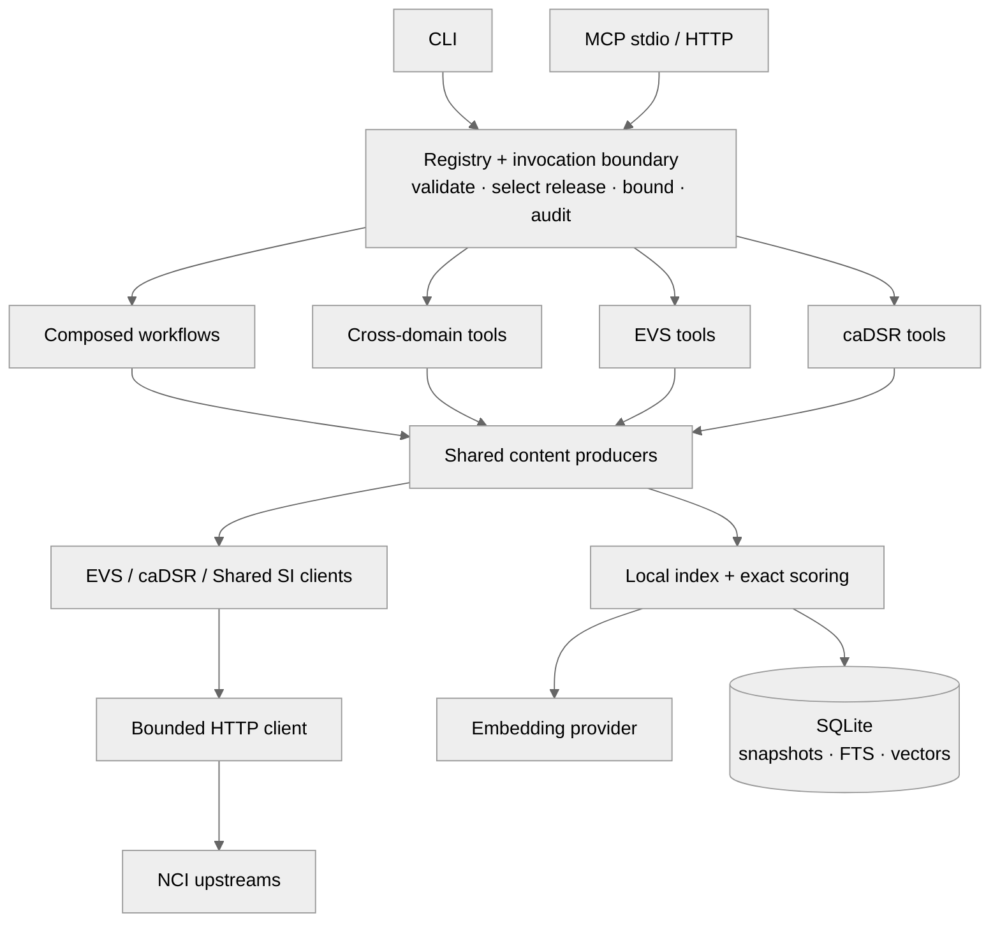
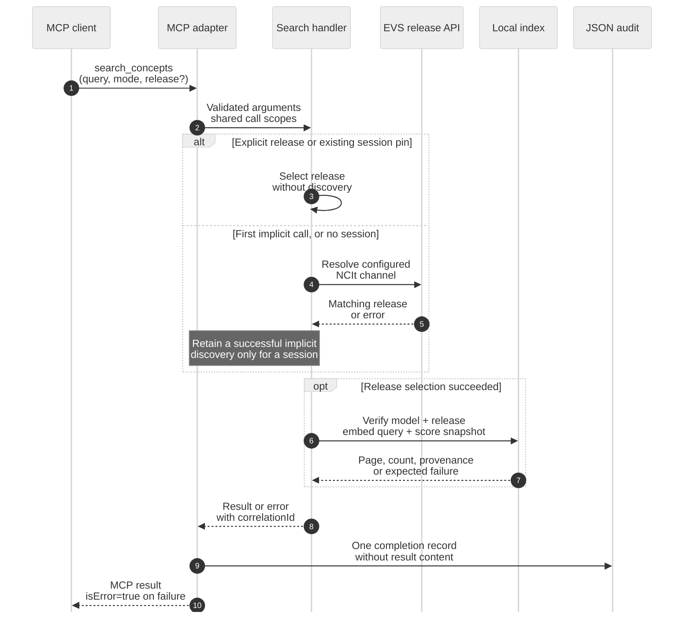
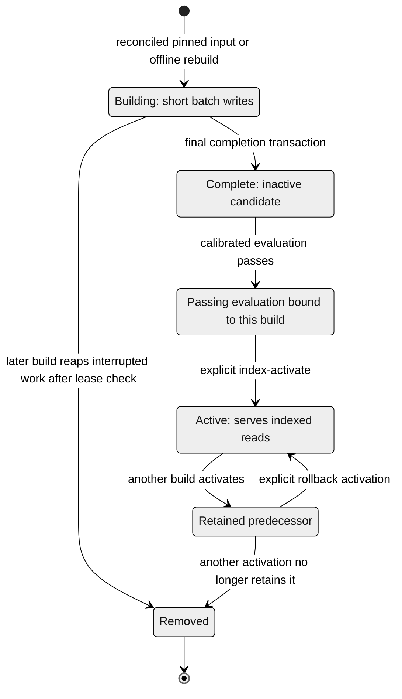
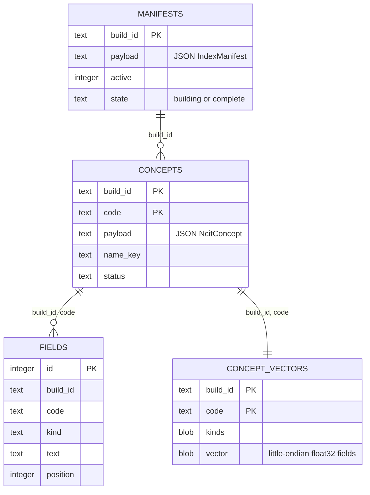

# NCI SI MCP Architecture

This document describes the implemented Python prototype: EVS terminology, caDSR metadata,
Shared SI joins and composed workflows served through MCP over stdio or HTTP, with a CLI for
index operations and the original EVS commands.
The diagrams use Mermaid, rendered directly by GitHub. They follow the useful levels of the
[C4 model](https://c4model.com/diagrams), with sequence, lifecycle and data views where needed.

The [Phase 6 architecture decision](docs/decisions/001-si-architecture-alignment.md) maps the
Semantic Infrastructure team's proposal to this implementation and records approved future
access contracts. Portable caller enforcement is implemented; production identity integration
remains pending. The [caller-permission flow](docs/caller-permissions.md) shows the opt-in boundary.

| View | Question it answers |
| --- | --- |
| [System context](#system-context) | Who uses the server, and which systems supply its content? |
| [Components](#component-schema) | Where do adapters, business rules and storage live? |
| [Request sequence](#an-indexed-search-call) | How do release selection, retrieval, errors and audit fit together? |
| [Index lifecycle](#index-lifecycle) | When can a build serve requests, and how does rollback work? |
| [Persistence schema](#persistence-schema) | How are concepts, fields and vectors related? |
| [Local and cloud deployment](docs/deployment.md) | Which processes, assets and network boundaries does an operator need? |
| [HTTP session routing](docs/transport.md#session-routing-sequence) | What happens when a known session reaches another replica? |
| [Release pipeline](docs/container.md#release-pipeline) | How does a tested commit become a verified image? |

## System context

Arrows name requests or supplied assets. Upstream systems own their content; the local index
holds retrieved NCIt snapshots. The acceptance harness can replace the upstreams with local
recorded or contract-crafted fixtures, including caDSR until credentials are issued.

## Component schema

This is a grouped dependency view, not an exhaustive import graph. Shared producers are the
functions in the content modules, not a separate service; workflows and cross-domain tools
compose them. `config.py` and
`context.py` construct the injected collaborators; traversal, relationship catalogues and
evaluation support the operations above. `models.py` and `results.py` define the records.
The registry derives adapter parameters from handler signatures; closed choices live in
`validation.py`. The shared boundary logs one completion record even when an invocation fails.

## Components

| Component | Responsibility | Main dependencies |
| --- | --- | --- |
| `caching.py` | Defines producer-selected hints: explicitly release-pinned content and the static server surface (86,400,000 ms/public), unpinned caDSR content (3,600,000/public), resolution/status (0/public), and implicit NCIt calls, computed matching results or errors (0/private). It contains no data cache. | Python standard library |
| `bounds.py` | Owns traversal defaults and maxima and the per-call `Budget`. A context variable shares 200 HTTP attempts, including retries, release discovery and split batches, and restores the previous context on exit. The walker rotates kinds across each breadth-first frontier and counts newly admitted nodes against optional per-kind allowances. Neighborhood and CLI traversal preserve partial graphs on exhaustion; without graph content they raise `RequestBudgetError`, mapped to `bound_exceeded`. Hierarchy page replay always fails with `bound_exceeded` on request exhaustion. | Python standard library |
| `cli.py` | Builds command arguments and dispatch from the registry; owns `serve` startup, reports configuration failures and exits 1 on an error record. | `registry.py`, `server.py` |
| `container_entry.py` | Starts the same server with externally supplied assets, verifies the index and loads the model offline; startup failures name the asset and error class without library messages. It never builds or activates an index. | `context.py`, `embeddings.py`, `transport.py` |
| `transport.py` | Stateful or stateless HTTP over the shared adapter; SDK authentication and scope hooks, Host/Origin admission, body cap, local readiness and token-free auth diagnostics. Sessions belong to one process. | `server.py`, optional MCP/Starlette/Uvicorn |
| `server.py` | Registers profile-selected tools, five resource templates and two concrete resources from the registry on an `mcp` 2.x `MCPServer`, and flags error records as protocol errors. Middleware carries cache decisions from SDK worker threads into tool `_meta` and resource fields, without inspecting content or matching names. Undeclared successful responses fail. SDK hints cover lists/discovery. | `registry.py`, `caching.py`, optional `mcp` package |
| `permissions.py` | Immutable request authority, capability checks and compound dependencies |
| `server_permissions.py` | Caller-filtered MCP surfaces and session ownership |
| `http_auth.py` | Operator-installed authentication integration, verified issuer/identity binding and required-startup validation |
| `registry.py` | Declares each operation once with its handler, output union, optional cache default and adapter exposure. Handlers that own the complete cache policy omit the default. Derives input models, CLI arguments and MCP parameters from handler signatures; selects tools by profile and invokes all producers through one boundary. | `handlers.py`, `invocation.py`, `caching.py`, `results.py` |
| `context.py` | Holds injectable settings, clients, index and embedding provider shared by a server or CLI invocation. | EVS client, local index, embeddings |
| `audit.py` | Emits one redacted JSON completion record per invocation, classifies parameters from the registry, counts actual HTTP attempts in request-scoped state, and formats diagnostics. | Correlation context, standard-library logging and SHA-256 |
| `handlers.py` | Validates inputs, orchestrates use cases, pins EVS requests to the configured release channel, enforces index compatibility and implements lookup fallback. Owns tool contracts and pinned resource content; absent and mismatched indexes are explicit errors. | `context.py`, release, traversal, evaluation |
| `catalogue.py` | Reads release-pinned roles and associations once per call, validates row identities and the configured terminology-specific exclusion set, and projects relationship records with polarity by code. Missing exclusions fail the listing and neighborhood call with internal_error and missingCodes; no startup reads or cross-call cache. | EVS client, models, configuration |
| `cursor.py` | Encodes continuation positions with their applied arguments. Validates cursor structure and known arguments before discovery, then binds the independently selected effective release before content access. | standard library, errors |
| `content.py` | Implements the EVS content surface at the effective release, projects spec concept/node/edge records, and explicitly refuses unsupported Phase 2 options. Reuses fetched graph payloads and batches missing node status reads within the traversal request budget. Indexed search checks the requested release inside its read transaction. | `context.py`, index, traversal, release, validation |
| `invocation.py` | Converts expected failures inside the audit correlation context through the single error-code table, preserving details and next steps. Unexpected exceptions propagate. | `errors.py`, upstream and domain exceptions |
| `upstream.py` | Parses an upstream response body as JSON content, and classifies a failure that arrived as a success (an HTML page, a webMethods `apiResponse.type` `E` envelope, a FHIR `OperationOutcome` error, invalid JSON) as `upstream_unavailable` before any caller sees it. | `errors.py` |
| `http_client.py` | The one HTTP client for upstream platforms: supports JSON GET/POST, form POST and explicitly requested bounded export text; sends the call's correlation identifier and the platform's credentials (never to another origin: a redirect elsewhere is refused); retries 5xx, 429 (after its `Retry-After`) and connection failures with jittered backoff, counting every attempt; bounds the response size; classifies the response (through `upstream.py`) before returning it; hands one record per attempt to a request-log hook (a hook that raises is logged by type and ignored). | Python `urllib`, `upstream.py`, `errors.py` |
| `evs.py` | Calls EVS REST endpoints through the HTTP client, classifies EVS-specific failures (missing concept, unknown release, unusable content and release mismatch) while shared HTTP failures propagate unchanged, reads the terminology listing (optionally one channel's `latest` row), and normalizes EVS payloads. | `http_client.py`, shared models, NCI EVS API |
| `cadsr.py` | Injectable caDSR client for data elements, forms, context names, crosswalks, matching and registry metadata. JSON contracts govern API shapes; keyword search is the requested OP-C03 operation, currently unserved. Match POSTs use a separate 45-second transport; only API transports hold Basic auth. Export listing reads are credential-free and parse the exact distribution row without guessing a timezone. Future verified registry pins must be echoed by content responses. | `http_client.py`, `release.py`, `config.py` |
| `cadsr_content.py` | Eight content/registry tools and their resources: validates selectors and pins, projects upstream element/form/map records, pages retrieved lists with argument-bound cursors, emits per-item provenance and selects the actual cache class. Unsupported capabilities fail explicitly. | `cadsr.py`, `release.py`, `cursor.py`, `caching.py`, `models.py` |
| `cadsr_matching.py` | Two matching tools validate all inputs before calls, translate documented bodies/headers and preserve upstream order, identity, rules and optional fields. Computed results use 0/private. Missing pin transport fails closed; any entity failure fails the whole call. | `cadsr.py`, `cadsr_content.py`, `caching.py`, `validation.py` |
| `workflows.py` | Ground values through independently bounded hops, expand cohorts from child hierarchy and root exclusions, and harmonize dictionary columns under one registry state. Each chain shares a request budget and effective content states; the fine-grained producers supply the content. | `content.py`, `seam.py`, `cadsr_matching.py`, `bounds.py` |
| `ssis.py` | Shared SI façade and bounded SPARQL client. Fixed templates accept validated identifiers; content queries retain one sentinel row. Both graphs' actual dates and optional versions are returned unchanged. Empty content lists succeed; identity reads require exactly both graphs. Malformed responses and HTTP rejections fail without claiming an unverified cause. | `http_client.py`, `config.py`, `validation.py` |
| `seam.py` | Four cross-domain handlers: graph-verified uses with one combined page/cap, latest-version exact permissible-value resolution, literal GDC/CRDC stored values, and four-dataset release alignment. Reuses call/session selection, budgets and content projection; never invents registry releases or stored values. | `ssis.py`, `evs.py`, `cadsr_content.py`, `content.py`, `cursor.py` |
| `fhir.py` | Reads and verifies the unpinned NCIt value-set expansion, projects members and applies inactive filtering and local offset paging. | `http_client.py`, release, shared models |
| `release_selection.py` | A lazy invocation scope resolves omitted NCIt releases once, with synchronized first discovery in MCP session state. Explicit releases bypass that state; other terminologies require one. Session withdrawal fails closed without rediscovery. The SDK connection owns HTTP session state; a stdio lifespan owns its stream state. Stateless and CLI calls retain no pin. Audit records the effective release and selection source, including content failures. Implicit calls are uncached/private because their arguments do not key the release; explicit calls keep the pinned public policy. | Release resolver, audit, context variables |
| `release.py` | The release model. `resolve_evs_release` asks EVS for the one row that is latest and tagged with the channel and returns the `ReleaseContext` that one call threads through its requests; zero or several rows are `release_not_available`, with ambiguous versions in `found`. Only terminology, channel, version and date are serialized; the pinned path stays internal. Discovery remains fresh; the implicit NCIt content pin alone can survive within an MCP session (X-22). `registry_state` builds `published`, optional `identifier`, `generatedAt` and `sourceDistribution` from upstream metadata. Without a registry release, the export folder supplies its local date-time, at minute precision without a timezone; it is preserved without an offset. Invalid metadata raises `RegistryMetadataError`, mapped to `upstream_unavailable`. | `evs.py`, `errors.py` |
| `index.py` | Builds inactive field indexes, activates snapshots with rollback retention, and ranks BM25/vector/hybrid results within one read snapshot. | SQLite FTS5, embedding provider, `index_storage.py`, `index_scoring.py` |
| `index_storage.py` | Defines schema 6 with float32 vector BLOBs, preserves raw concepts and build activation during migration, and manages per-build FTS tables. | SQLite, shared models |
| `indexing.py` | Reconciles all pinned full-build pages before writing the index; spools raw payloads and logs aggregate progress. | EVS client, local index |
| `index_scoring.py` | Scores every indexed field in one scan, reduces numeric arrays to each concept's best field, and partitions the requested page with deterministic ties. | SQLite FTS5, optional NumPy |
| `embeddings.py` | Defines the embedding abstraction, a deterministic local hashing provider, an optional sentence-transformers provider, and the check that provider and model settings agree. | Optional `sentence-transformers` package |
| `traversal.py` | Resolves which edge types to follow and performs a breadth-first traversal of hierarchy, role, and association relations with deduplication and hard depth/node/edge limits, and gives each node and edge its traversal provenance and the walk its truncation record. | EVS client, shared models |
| `models.py` | Defines the serializable concept, index, search-hit and traversal dataclasses, and the provenance, traversal provenance and truncation records every result is built from. | `errors.py` |
| `results.py` | Declares the serialized tool records as dependency-free TypedDicts, including optional wire keys and recursive truncation. Registry output declarations combine each success record with the shared error result; the MCP SDK generates their output schemas through a RootModel, preserving the top-level object. | `errors.py`, `validation.py` |
| `evaluation.py` | Reports per-query rankings and Hit@1, Hit@5 and reciprocal-rank metrics for BM25, vector and hybrid search; evaluates inactive candidates and stores build-specific gate evidence. | Local index, embedding provider, evaluation sets |
| `evaluation_sets.py` | Validates versioned judgments, calibration identity and measured regression floors; distinguishes test-only calibration. | Standard library |
| `config.py` | Loads the profile, the upstream mode and the six upstream base URLs (taken as a set: production defaults in live mode, all required in fixture mode), release channel, exclusion role codes, the two credentials (kept out of every string form), timeouts, EVS retry, batching, logging, data-directory and embedding settings from environment variables and validates them; whether the data directory is usable shows only when the index is opened. | Environment, `embeddings.py`, `validation.py` |
| `validation.py` | Defines the closed value sets (search modes, directions, edge types), normalizes NCIt codes, and validates search and traversal inputs. | Shared errors, limits in `bounds.py` |
| `errors.py` | Defines the validation and index errors, `PlatformError` with the ten error codes of the specification, the per-call correlation identifier, and `serialise`, the one function that builds the error record. | Python standard library |

## Primary flows

### An indexed search call

This example is `search_concepts` in semantic/hybrid mode for NCIt. The release decision is
shared for the call; a handshake session may already hold an implicit pin. Lexical/typeahead
search instead reads EVS content, and CLI invocations do not retain a session pin.

Input validation refusals are audited too and do not reach upstream. Unexpected exceptions
are logged by type and propagate; they are never presented as empty success. HTTP admission
and optional authentication precede this tool invocation (see [transport](docs/transport.md)).

### Build a local index

1. `index-sample` enters through the CLI and invokes `handlers.index_codes` through the registry.
2. The handler validates and deduplicates the codes, resolves the single latest
   NCIt release of the configured channel, then retrieves the concepts from EVS in bounded
   batches, each request pinned to that release. If EVS does not return every
   code, nothing is indexed.
3. `LocalIndex` normalizes each concept and verifies the payload release and
   embedding provider/model/dimensions before changing persistent state.
4. Preferred name, synonyms and definitions become separate field rows, deduplicated
   by identical text within each concept. Embeddings are computed in batches of 64
   concepts outside write transactions. Each batch commits under a `building` manifest;
   a final short transaction marks it complete. Partial builds never serve reads or activate.
   The next start deletes stale building rows. A small separate SQLite lease distinguishes
   a running builder from an interrupted one without holding the index write lock.
5. The developer sample command combines existing same-release concepts and activates
   the new snapshot. `index-build` instead reads unfiltered pinned search pages of 1000,
   verifies every release, reconciles totals and unique codes, then builds an inactive snapshot.
   Temporary spooling bounds download memory. Progress is structured JSON on stderr every
   ten pages and at completion. HTTP retries remain in the shared client.
6. `index-activate` changes the active manifest in one transaction and deletes all builds
   except the new active build and its predecessor. Activating that predecessor is rollback.
   `index-rebuild` embeds stored payloads offline into an inactive snapshot.

### Index lifecycle

These are logical lifecycle stages, not extra database enum values: persisted `state` is
`building` or `complete`; activation and evaluation evidence are separate. The diagram follows
a production build. Developer samples have a separate activation path without the production
evaluation gate. Failure leaves the current active build serving.
A failed evaluation leaves its candidate complete and inactive.

Activation keeps only the selected build and the former active build, deleting other snapshots
in the same transaction. Distribution to serving replicas is a separate operator step in the
[deployment view](docs/deployment.md#cloud-one-reference-layout).

### Search

1. The CLI invokes `handlers.search`; MCP invokes `content.search_concepts` through the
   same registry. The MCP entry pins the caller's release. Lexical/typeahead search passes
   EVS order through without scores, preserving only lexical highlights. Semantic/hybrid
   search uses the exact NCIt index and requires the optional NumPy `index` extra.
2. `LocalIndex` verifies that the runtime embedding configuration matches the
   manifest. For MCP, it also verifies the requested release inside the read transaction.
3. BM25 scores come from SQLite FTS5 without a candidate cap. Each concept's field vectors
   occupy one float32 BLOB; a single scan scores every field in bounded matrix chunks.
   Compact per-query numeric arrays retain cosines, concept indices and field kinds.
   Hybrid scatters matching BM25 scores into those arrays. No vector matrix is cached.
4. Each component is min-max normalized over the fields scored for the query
   and combined as BM25, vector, or a `0.55 * BM25 + 0.45 * vector` hybrid
   score. Scores order the hits of one query; they are not comparable across
   queries. Each concept appears once with its winning field in `matchedOn`; equal
   scores prefer name, synonym, then definition. An exact preferred name, compared
   case-insensitively after Unicode NFC and whitespace collapsing, scores 1 and wins
   ties before other concepts. Code orders remaining ties, including ties at a partition
   boundary. `totalKnown` counts all matches after the retirement filter, in the same
   snapshot as the page and manifest. Retired-only selection uses the pinned terminology's
   advertised status; an unsupported selection is invalid, never silently unfiltered.
5. Ranked `SearchHit` objects are returned. Each hit's concept carries its provenance
   (`source: evs_index`), and raw EVS payloads are left out unless the CLI's
   `--include-raw` asks for them. MCP returns `nextCursor` until the final page, without
   truncation. Cursors bind applied arguments, the pinned release and, for indexed modes,
   the internal build id. An activation expires indexed cursors even if the release is
   unchanged. EVS cursors expire when their pinned release is withdrawn. The CLI's one-page
   `search_with_truncation` instead reports an exact count of omitted concepts.
   An empty result carries provenance for its selected source.

### CLI lookup and the concept resource

1. The handler resolves the current release of the configured channel (monthly by
   default) with `resolve_evs_release`, once for this call. If the index holds a
   different release, lookup fails with `release_mismatch` unless `live_only` is
   set, so that lookups and searches never mix releases. With `live_only` the
   call does not read the index; the CLI still opens it at startup.
2. The concept is requested from live EVS, pinned to that release, and the
   release of the answer is verified. A code the release does not contain is
   `not_found`.
3. If EVS cannot be reached, lookup returns the concept from the index unless
   `live_only` is set. The result then has `provenance.source: evs_index`,
   `servedBy: index` and a `fallback` object with the reason. A channel without exactly one latest release is not an
   outage: lookup fails with `release_not_available` and does not use the cache.

The MCP `get_concept` entry instead calls `content.get_concept`, pins the caller's release,
and requests only the selected sections. It neither consults the index nor falls back to it.
It returns a specification concept record with upstream name, active/status and provenance.

### Traverse

1. For the CLI, direction, the include flags, and `edge_types` select the edge types to
   follow. A combination that selects nothing, or names an edge type the
   direction excludes, is rejected before any request is made.
2. The CLI handler resolves the configured channel once; MCP graph entries instead use
   the caller's release and select kinds from `kinds` or the hierarchy `direction`.
   Both call `traverse_ncit` with one shared `Budget`.
3. The walk is breadth-first, one depth at a time over all start codes, so
   nearer nodes claim the limits before farther ones. Each level is read with
   batched concept requests that include the selected relation lists, pinned to
   the release, and every fetched concept is checked against it. Requested
   depth clamps at 4. Neighborhood allows up to 1,000 nodes including the seed
   and 5,000 edges. Hierarchy allows up to 1,000 returned nodes per page excluding the
   seed and has no edge cap; continuation replays the pinned walk within the request budget.
   Forward lists at the last frontier are also read, within the same request budget, to distinguish
   a depth cut from a leaf or a cycle to returned nodes. Each batch is processed
   before the next request so the first bound reached keeps precedence.
   A depth cut counts distinct unseen targets one level further, with `exact: false`.
   A reported global node cut skips this check; otherwise it reads only kinds
   with no prior cut. The content adapter still fetches missing node status
   without relation lists before returning public concept records.
   Each selected inverse kind without a prior cut reports depth at any nonempty final frontier with
   `omitted: 0`, `exact: false`; its potentially huge lists are never read solely
   for this check. This explicitly leaves continuation unknown. Descendant checks
   read the final nodes' child lists.
4. `descendant` edges are followed only on request. They come from one EVS
   request per start code, pinned to the release and limited to `max_depth`
   levels, and each is emitted together with the other edges that reach the
   depth of its level. EVS gives a descendant one level, which can be deeper
   than its shortest path.
5. Edges are deduplicated, every emitted edge references emitted nodes, and the
   `Truncation` record names the first bound that dropped anything and counts what it
   dropped (`exact` is false: what lies beyond a dropped item was never read). A concept
   whose relations or descendants exceed the EVS response-size limit is kept as a node and
   counted against the `upstream_cap` bound; the log names it. Its relation lists come in
   one response and its descendants in another: the response that was too
   large contributes no edges, so oversized relations drop every selected
   relation type of that concept, and the other response is still used.
6. Every node and edge carries a `TraversalProvenance`: the release, `evs_rest` and
   `live`, the walk's time and correlation identifier, the URL of the resource that holds
   the item, its `depth`, and for any item but a start code the `relationship`, `direction`
   and `polarity` of the edge that reached it. Polarity is decided by the relationship's
   code against the NCIt exclusion set, never by its name.
7. MCP converts the graph to specification concept and edge records, with edges in assertion
   orientation. Hierarchy excludes the seed and pages in breadth-first platform order.
   Its cursor binds the applied arguments and position; each call replays the pinned walk
   within 200 requests. The page window is not truncation; other bounds still report the
   first real omission. Exhausted replay is bound_exceeded, never a false final page.
   A served historical release continues without discovery. Only its withdrawal triggers
   current-channel discovery and cursor_expired with both release identifiers.
   pathsToRoot preserves every platform path and projects unique reached nodes; depth,
   limit and cursor do not apply to that direction.
8. Neighborhood includes negative targets but expands them only with includeNegative or
   a positive route. Eligibility is separate from visibility, so an earlier negative
   arrival cannot suppress later positive expansion, including after per-kind re-admission.
   Depth follows the eligible route; node provenance retains its first arrival. Upstream
   relationship codes and names identify edges together, preserving same-named assertions.
   Missing codes remain absent and positive; qualifiers, evidence and licence text pass
   through. Legacy CLI name filters leave hierarchy edges intact; their invented names
   are removed.

## Provenance

`models.py` holds the records that every tool result is built from: `ProvenanceEnvelope`
(the specification's provenance record, field for field, written in camelCase by `to_dict`),
`TraversalProvenance` (adds the traversal record's fields) and `Truncation` (the truncation
record). Each item is given its envelope where it is built: `NcitConcept.provenance` for a
looked-up or indexed concept, the `_Walk` for traversal nodes and edges, `IndexManifest.to_result`
for the index (the same record in `index-sample` and in the release report), and the handlers for
the release report. The correlation identifier is read from
`errors.call_correlation_id`; the audit boundary supplies one shared by registry invocation, so
that every item and error of a call carries the same. The stored form of a concept
(`NcitConcept.to_stored`) keeps the full EVS payload; the result form leaves it out unless the
CLI asks.

## Audit and diagnostics

`registry.invoke` opens an `audit.audited` scope for CLI and resource calls. MCP opens the
same scope before input validation, and the registry invocation shares it. One completion
record therefore covers successful calls, validation refusals, expected errors and unexpected
exceptions; unexpected exceptions retain their type and propagate. Each call has its own
context-variable state. The HTTP client's per-attempt record increments the audit count before
notifying its optional observer; a request refused by the traversal budget is never counted.

The record carries timestamp, correlationId, tool, supplied parameters, terminology/context
target, requested release and the distinct release references in result provenance, status,
responseCode, outboundRequests, resultSize, truncation and elapsedMs. `resultSize` counts
UTF-8 bytes of compact JSON content, excluding MCP framing; it is null when no structured
result exists. Result content itself is never logged. Full per-kind truncation is preserved.

Every parameter's plain/hash class is declared beside its ToolSpec. Unknown names and values
are hashed. SHA-256 hashes correlate repeated inputs; they provide no secrecy for guessable
public terminology queries. Configured credentials, their Basic encoding and password are
redacted before a record reaches logging, including accidental echoes in metadata. This takes
precedence if a caller puts a credential in its correlation identifier. Diagnostic exception
messages and raw upstream bodies are excluded; external diagnostic messages are hashed.
All records use strict JSON on stderr; nonfinite input numbers are represented as strings
(`inf`, `-inf`, `nan`) in audit metadata. The diagnostic log-level setting does not suppress completion
records. The platform still owns authoritative audit, quotas and authorisation; this module
adds no persistent audit store, rate limiter or invented upstream audit headers.

## Persistence schema

Schema 6 retains completed build snapshots. One partial unique index permits only one active
manifest. Each build has its own FTS5 table, keyed by field id, so inactive builds cannot change
the active BM25 corpus statistics. Activation retains exactly the new active snapshot and
its predecessor. Embedding runs outside transactions; bounded writes accumulate under a `building` row.
Only a final completion transaction makes it eligible for evaluation. Production activation
also requires a passing report bound to that build, release and embedding configuration;
samples are exempt. Rebuilt unclassified snapshots become production builds, while their
originals remain available for rollback. The next build start
removes stale rows, while a separate SQLite lease protects concurrently running builders.
Field vectors are grouped per concept, with their kinds and positions linking them to FTS.
The manifest supplies the dimension; malformed BLOB lengths are storage failures.
New SQLite files use 64 KiB pages to reduce overflow-page I/O for vector scans. Existing files
keep their page size; conversion requires an explicit offline `VACUUM` as described in QUICKSTART.

Schema-5 migration preserves raw concepts, manifests, activation, FTS ids and retirement status,
converting its JSON vectors to float32 without embedding again. Earlier-schema migration
preserves raw concepts and manifests and marks them rebuild-required.
Their cached lookup remains available; search returns `capability_unavailable` naming
`index-rebuild`. That command embeds stored payloads into a new inactive build without
network access; activation is explicit. No embedding runs while opening a database.

A cached concept keeps the `retrieved_at` time at which it was fetched from EVS
for indexing.

## Public surface

MCP tools:

- `resolve_release`
- `list_terminologies`

- `get_concept`
- `get_concepts`
- `list_relationships`
- `resolve_retired_code`
- `get_concept_subsets`
- `get_concept_mappings`
- `expand_value_set`
- `search_concepts`
- `get_concept_hierarchy`
- `get_concept_neighborhood`

MCP resources:

- `ncit://concept/{release}/{code}`
- `ncit://release/{version}`
- `ncit://index/manifest/{release}`

The `evs` profile exposes twelve EVS tools; `cadsr` exposes ten caDSR tools;
`unified` exposes both plus four cross-domain and three workflow tools (29 total), and four
furnished prompts. Prompt templates are packaged in `data/prompts.json`, with a test requiring
exact equality with `spec/prompts.yaml`; only profiles containing every named tool expose them.
caDSR data-element resources (latest or named item version) and the
concrete registry-state resource carry unpinned provenance and a short public cache hint.
Each tool has group metadata and read-only, idempotent,
non-destructive, open-world annotations. EVS resources are available in `evs` and `unified`
only. Every EVS resource is release-pinned; concept reads use `get_concept` with every supported
section, release reads use the requested served version's metadata, and index reads serve only
the active matching manifest, with `source: evs_index` and `servedBy: index` provenance.

The CLI retains lookup, indexed search, traversal, release-info, sample indexing and
retrieval evaluation diagnostics. The release report uses `selected_release`; moving resource
aliases are removed. QUICKSTART.md lists the error codes.

## Current boundaries

- NCIt is the only indexed terminology. Lexical/typeahead search uses EVS directly;
  semantic/hybrid search requires a matching active index and the optional NumPy extra.
- Traversal is live against EVS rather than cached in SQLite. Inward walks are
  slower than outward ones because the inverse relations of hub concepts are
  megabytes each.
- Exact vector search scans every field on each page. Per-query numeric score arrays grow
  with the field count; vectors are processed in chunks and never cached as a full matrix.
- caDSR tools are implemented against contract-crafted fixtures; no credentials
  have been issued. Keyword search remains
  a requested upstream operation; type-E responses retain upstream_unavailable with fixed
  per-tool guidance. Search filters, semantic/hybrid search and standalone classifications are unavailable.
- Standalone permissible-value retrieval is unavailable (OP-C10), although REST publishes an id.
  Code maps use the CRDC list alone. Published form and matching pins are unavailable until
  their upstream transport exists. The requested C-1 CRDC fixture sends and echoes its pin.
- Form-by-ID alone interprets HTTP 200, explicit form:null and type E as not_found after id
  validation. A genuine failure in the identical shape is indistinguishable; #42 requests an
  unambiguous upstream absence signal. The operation interpretation raises before the common
  parser, which still classifies every other shape/status/operation unchanged.
- Index builds and activation are operator commands. Production activation requires a
  persisted passing evaluation for that build; the operator runbook follows in #40.
- The package requires Python 3.14 or newer. The `mcp` package comes with the
  optional `server` extra, which only the `serve` command and the server tests
  need.

## Verification map

- `tests/test_evs.py`: failure mapping, release verification, and concept normalization.
- `tests/test_release.py`: one-row release resolution per channel and its failures, the unknown-release 404, the release being resolved afresh in every call, and the caDSR registry state.
- `tests/test_evs_client.py`: failure classification, response limits, payload shapes, and request URLs through the EVS client.
- `tests/test_http_client.py`: headers, correlation, counted retries, `Retry-After`, the request-log hook, and credentials (sent to their platform only, in no log, record or error).
- `tests/test_index.py`: sample updates and build retention, rollback, embedding compatibility, migrations, and BM25/vector/hybrid search.
- `tests/test_handlers.py`: lookup (live, fallback, mismatch, not found), indexing, search, traversal, status, and the mapping of failures to error codes, details and next steps.
- `tests/test_errors.py`: the error record, its closed set of codes, and the correlation identifier.
- `tests/test_upstream.py`: failures masked as success responses (HTML, webMethods, FHIR), also through the EVS client.
- `tests/test_traversal.py`: edge-type selection, batching, depth/node/edge limits, descendants, deduplication, and graph integrity.
- `tests/test_validation.py`: public input validation and embedding configuration.
- `tests/test_config.py`: environment parsing and settings validation.
- `tests/test_evaluation.py`: ranking metrics.
- `tests/test_registry.py`: profile inventories, annotations, shared argument defaults and overrides, CLI maintenance commands and unchanged upstream error details.
- `tests/test_cli.py`: argument parsing, command dispatch, exit codes, and startup failures.
- `tests/test_server.py`: tool and resource registration, results, and protocol-level errors over an in-process MCP session.
- `tests/test_docs.py`: the settings, error codes and modules the documentation names against the code.
- `tests/test_quality_gates.py`: the complexity and test-quality gates in `scripts/validation`.
- `tests/test_release_config.py`: the pull request title check against the release configuration.
- `acceptance/`: the behavioural acceptance suite, which tests the MCP tool surface through a fixture upstream ([acceptance/README.md](acceptance/README.md)).

### EVS content identity

Existing concept, batch and descendant client methods require a `ReleaseContext`; there is no
unpinned content default. Full concepts must report the requested version and terminology.
All 33 recorded terminology rows use `{terminology}_{version}` as `terminologyVersion`; a
fixture-backed test pins that construction. Codes without a stated form are encoded as one
path segment. Licence attribution comes only from the content payload that supplied it.

Compact descendant entries do not report a version or terminology. Their provenance names
the release addressed by the request, with no invented `upstream` version. When a later read
fetches the full concept for its details, that payload is verified.

### Public concept batches

`get_concepts` makes one nonempty batch request, deduplicating codes on the wire and
reconciling the unordered reply by code. Both output lists retain input order and duplicate
occurrences. Unsolicited or duplicate upstream identities fail closed. Empty input makes no
request; response-size failure returns `bound_exceeded` with `NCI_SI_EVS_MAX_RESPONSE_BYTES`, never a partial batch.

EVS [limits batches to 1000 codes](https://github.com/NCIEVS/evsrestapi/blob/af1b2794ba944dad5c00e7958eaafb90267f2df0/src/main/java/gov/nih/nci/evs/api/controller/ConceptController.java#L177),
but the deployed URL ceiling is lower. Credential-free IPv4 probes on 5 October 2026, using
repeated C202904 with minimal detail, returned HTTP 200 at encoded request-target lengths
5046 and 7546 bytes, HTTP 400 at 8046, and HTTP 414 at 8296 and 10046.
`bounds.HARD_MAX_BATCH_CODES = 650` and `MAX_BATCH_TARGET_BYTES = 7000` leave 546 bytes
(7.2%) below the largest successful probe. The byte check uses the actual HTTP URL formatter,
including the configured base path, pinned release, escaped codes and include fields. The count
applies before deduplication; either excess is `invalid_request`, without truncation or splitting.

### FHIR value-set expansion

`expand_value_set` accepts exactly one of `valueSet` or `code`, with required terminology
and release. EVS enumerates NCIt subsets only; other terminologies return
`capability_unavailable` after argument validation and without a request. The FHIR client uses
`NCI_SI_EVS_FHIR_BASE_URL` and shares REST's timeout, retry, licence-key and
`NCI_SI_EVS_MAX_RESPONSE_BYTES` settings through `HttpClient`.

The recorded platform rejects `system-version`, and its subset enumeration uses latest monthly.
Under A3.2 the client requests the unpinned expansion directly, verifies its identity and exact
`ValueSet.version` before projecting members, and returns `release_mismatch` on a difference.
No version normalization, pinned probe, cross-call cache or historical expansion claim is made.
Verified results advertise the pinned-content cache hint; mismatches are private with zero TTL.

The complete flat expansion is checked against its reported total before inactive members are
filtered and offset/count applied locally. Nested, incomplete or malformed answers fail closed.
Count defaults to 200 and clamps to 1000; offset defaults to 0 and activeOnly to false. Paging,
including clamped paging, is not truncation; offset at or beyond total returns an empty page.
Every member carries source-release provenance with the actual FHIR url/version; copyright text
passes through only when supplied. Inactive appears only when true. Oversized responses fail
through the shared byte-cap error, never as partial expansion data.

### Concept subsets and mappings

`get_concept_subsets` and `get_concept_mappings` each read the pinned concept once with
`minimal,associations` or `minimal,maps`. They verify the concept identity and release before
projecting records. Subsets select the exact `Concept_In_Subset` association type, including
computed associations without a relationship code, and take their terminology from the concept.
Maps preserve the specified field values and platform order; extra upstream keys are excluded.
Optional target version and term type are omitted when absent, null or empty. Missing required
fields fail the entire call, even when a target filter would exclude the malformed map.
The target filter matches the platform label exactly, including case. Provenance describes
the source concept and its release; the map's target version remains separate. Supplied licence
text passes through, with item attribution taking precedence over the source concept's.
Empty results retain source provenance. Subset membership endpoints and incoming cross-domain
mapsets are separate capabilities.

### Retired code resolution

`resolve_retired_code` reads the pinned concept once and uses only its boolean `active` to
decide whether to read history. Status remains the upstream value. Inactive concepts use
`/history/{terminology}_{release}/{code}/replacements`; the one-code tool does not need the
batch endpoint or split/retry logic. A history 404 follows `_get_existing` into an error;
a successful empty history or a row naming no replacement yields `replacements: []`.
Replacement codes and names remain unchanged. Their provenance names the history request
and its pinned release, without inventing the version compact rows do not carry. Any
optional upstream terminology/version is validated, and supplied licence text passes through.
HTTP uses the same adapter and registry as stdio. SDK sessions and their implicit NCIt pins
belong to one process: stateful replicas require affinity, while stateless requests resolve
omitted releases per call. [Transport details](docs/transport.md) cover reconnection, health,
readiness and authentication injection.

### Caller authority

`permissions.py` scopes immutable caller authority across registry and nested producer calls.
`server_permissions.py` filters MCP surfaces and protects invocation; `transport.py` applies
HTTP no-store to secured responses. See the [security flow and capability map](docs/caller-permissions.md).
