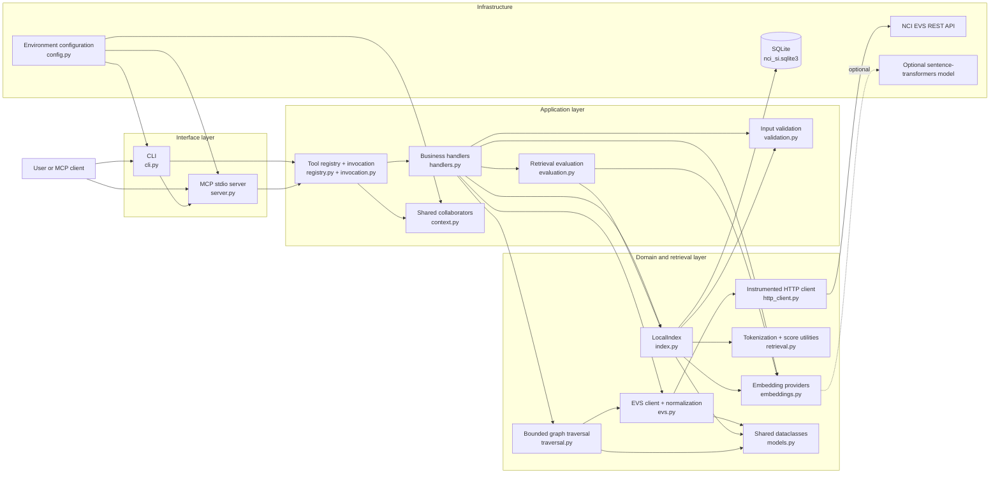
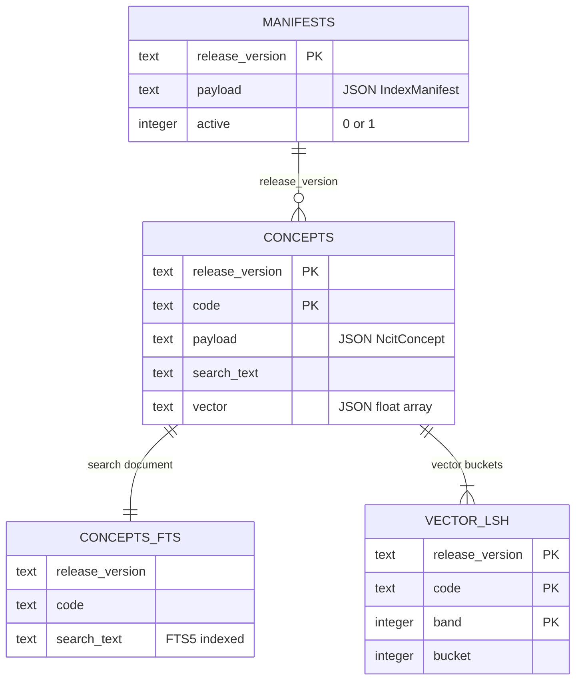

# NCI SI MCP Architecture

This document describes the repository as implemented. The project is an
EVS-first Python prototype that exposes NCI Thesaurus (NCIt) retrieval through
both a command-line interface and a local Model Context Protocol (MCP) server.

## Component schema

`errors.py` is used by every layer and is left out of the diagram. Also not
drawn: `http_client.py` parses its response bodies with `upstream.py`, `index.py` calls the concept normalization in `evs.py`, and the registry derives both adapters' parameters from handler signatures,
which use the closed value sets in `validation.py` and default limits in `bounds.py`, where `validation.py` also reads the hard node limit.

## Components

| Component | Responsibility | Main dependencies |
| --- | --- | --- |
| `caching.py` | Defines the hints for current producers: governed release-pinned content and the static server surface (86,400,000 ms/public), resolution/status (0/public), and errors (0/private). It contains no data cache or unused future policy classes. | Python standard library |
| `bounds.py` | Owns traversal defaults and maxima and the per-call `Budget`. A context variable shares 200 HTTP attempts, including retries, release discovery and split batches, and restores the previous context on exit. The walker rotates kinds across each breadth-first frontier and counts newly admitted nodes against optional per-kind allowances. Exhaustion preserves partial graphs with truncation; without graph content it raises `RequestBudgetError`, mapped to `bound_exceeded`. | Python standard library |
| `cli.py` | Builds command arguments and dispatch from the registry; owns `serve` startup, reports configuration failures and exits 1 on an error record. | `registry.py`, `server.py` |
| `server.py` | Registers the profile-selected tools and three resource templates from the registry on an `mcp` 2.x `MCPServer`, and flags error records as protocol errors. Middleware carries cache decisions from SDK worker threads into tool `_meta` and resource fields, without inspecting content or matching names. Undeclared successful responses fail. SDK hints cover lists/discovery. | `registry.py`, `caching.py`, optional `mcp` package |
| `registry.py` | Declares each operation once with its handler, output union, cache class and adapter exposure. Derives input models, CLI arguments and MCP parameters from handler signatures; selects tools by profile and invokes all producers through one boundary. | `handlers.py`, `invocation.py`, `caching.py`, `results.py` |
| `context.py` | Holds injectable settings, clients, index and embedding provider shared by a server or CLI invocation. | EVS client, local index, embeddings |
| `audit.py` | Emits one redacted JSON completion record per invocation, classifies parameters from the registry, counts actual HTTP attempts in request-scoped state, and formats diagnostics. | Correlation context, standard-library logging and SHA-256 |
| `handlers.py` | Validates inputs, orchestrates use cases, pins EVS requests to the configured release channel, enforces index compatibility and implements lookup fallback. Owns tool contracts and resource content; moving aliases and absent-index reports select status cache policy. | `context.py`, release, traversal, evaluation |
| `catalogue.py` | Reads release-pinned roles and associations once per call, validates row identities and the configured terminology-specific exclusion set, and projects relationship records with polarity by code. Missing exclusions fail the listing and neighborhood call with internal_error and missingCodes; no startup reads or cross-call cache. | EVS client, models, configuration |
| `content.py` | Implements the caller-pinned EVS content surface, projects spec concept/node/edge records, and explicitly refuses unsupported Phase 2 options. Reuses fetched graph payloads and batches missing node status reads within the traversal request budget. Indexed search checks the requested release inside its read transaction. | `context.py`, index, traversal, release, validation |
| `invocation.py` | Converts expected failures inside the audit correlation context through the single error-code table, preserving details and next steps. Unexpected exceptions propagate. | `errors.py`, upstream and domain exceptions |
| `upstream.py` | Parses an upstream response body as JSON content, and classifies a failure that arrived as a success (an HTML page, a webMethods `apiResponse.type` `E` envelope, a FHIR `OperationOutcome` error, invalid JSON) as `upstream_unavailable` before any caller sees it. | `errors.py` |
| `http_client.py` | The one HTTP client for upstream platforms: sends `Accept: application/json`, the call's correlation identifier and the platform's credentials (never to another origin: a redirect elsewhere is refused); retries 5xx, 429 (after its `Retry-After`) and connection failures with jittered backoff, counting every attempt; bounds the response size; classifies the response (through `upstream.py`) before returning it; hands one record per attempt to a request-log hook (a hook that raises is logged by type and ignored). | Python `urllib`, `upstream.py`, `errors.py` |
| `evs.py` | Calls EVS REST endpoints through the HTTP client, classifies EVS-specific failures (missing concept, unknown release, unusable content and release mismatch) while shared HTTP failures propagate unchanged, reads the terminology listing (optionally one channel's `latest` row), and normalizes EVS payloads. | `http_client.py`, shared models, NCI EVS API |
| `release.py` | The release model. `resolve_evs_release` asks EVS for the one row that is latest and tagged with the channel and returns the `ReleaseContext` that one call threads through its requests; zero or several rows are `release_not_available`, with ambiguous versions in `found`. Only terminology, channel, version and date are serialized; the pinned path stays internal. Nothing is kept between calls. `registry_state` builds `published`, optional `identifier`, `generatedAt` and `sourceDistribution` from upstream metadata. Without a registry release, the export's `Last-Modified` supplies the date. Invalid metadata raises `RegistryMetadataError`, mapped to `upstream_unavailable`. | `evs.py`, `errors.py` |
| `index.py` | Migrates and transactionally maintains the release manifest, normalized concepts, FTS search text, vectors, and vector LSH buckets; performs BM25/vector/hybrid search. | SQLite FTS5, retrieval utilities, embedding provider, `validation.py`, concept normalization in `evs.py` |
| `retrieval.py` | Implements tokenization, the dot product used as cosine similarity for unit vectors, and min-max normalization. | Python standard library |
| `embeddings.py` | Defines the embedding abstraction, a deterministic local hashing provider, an optional sentence-transformers provider, and the check that provider and model settings agree. | Optional `sentence-transformers` package |
| `traversal.py` | Resolves which edge types to follow and performs a breadth-first traversal of hierarchy, role, and association relations with deduplication and hard depth/node/edge limits, and gives each node and edge its traversal provenance and the walk its truncation record. | EVS client, shared models |
| `models.py` | Defines the serializable concept, index, search-hit and traversal dataclasses, and the provenance, traversal provenance and truncation records every result is built from. | `errors.py` |
| `results.py` | Declares the serialized tool records as dependency-free TypedDicts, including optional wire keys and recursive truncation. Registry output declarations combine each success record with the shared error result; the MCP SDK generates their output schemas through a RootModel, preserving the top-level object. | `errors.py`, `validation.py` |
| `evaluation.py` | Evaluates BM25, vector, and hybrid retrieval against a small built-in gold-query set. | Local index, embedding provider |
| `config.py` | Loads the profile, the upstream mode and the six upstream base URLs (taken as a set: production defaults in live mode, all required in fixture mode), release channel, exclusion role codes, the two credentials (kept out of every string form), timeouts, EVS retry, batching, logging, data-directory and embedding settings from environment variables and validates them; whether the data directory is usable shows only when the index is opened. | Environment, `embeddings.py`, `validation.py` |
| `validation.py` | Defines the closed value sets (search modes, directions, edge types), normalizes NCIt codes, and validates search and traversal inputs. | Shared errors, limits in `bounds.py` |
| `errors.py` | Defines the validation and index errors, `PlatformError` with the ten error codes of the specification, the per-call correlation identifier, and `serialise`, the one function that builds the error record. | Python standard library |

## Primary flows

### Build a local index

1. `index-sample` enters through the CLI and invokes `handlers.index_codes` through the registry.
2. The handler validates and deduplicates the codes, resolves the single latest
   NCIt release of the configured channel, then retrieves the concepts from EVS in bounded
   batches, each request pinned to that release. If EVS does not return every
   code, nothing is indexed.
3. `LocalIndex` normalizes each concept and verifies the payload release and
   embedding provider/model/dimensions before changing persistent state.
4. Search text, embeddings, FTS rows, vector LSH buckets, and the manifest are
   committed in one SQLite transaction. Concepts of the release already indexed
   are added to it; concepts of another release replace the index. A failure
   leaves the previous index untouched.

### Search

1. The CLI invokes `handlers.search`; MCP invokes `content.search_concepts` through the
   same registry. The MCP entry pins the caller's release, maps `semantic` to vector search,
   and refuses lexical/typeahead, cursors and retired-only selection pending #27.
2. `LocalIndex` verifies that the runtime embedding configuration matches the
   manifest. For MCP, it also verifies the requested release inside the read transaction.
3. BM25 candidates come from SQLite FTS5. For vector scores, a release of up to
   20,000 concepts is scanned exactly; a larger one is narrowed to at most 2,000
   candidates from the LSH buckets and the BM25 hits before scoring. Work for an
   unused retrieval mode is skipped.
4. Each component is min-max normalized over the concepts scored for the query
   and combined as BM25, vector, or a `0.55 * BM25 + 0.45 * vector` hybrid
   score. Scores order the hits of one query; they are not comparable across
   queries.
5. Ranked `SearchHit` objects are returned. Each hit's concept carries its provenance
   (`source: evs_index`), and raw EVS payloads are left out unless the CLI's
   `--include-raw` asks for them. `search_with_truncation` also counts the scored
   concepts that `limit` left out and returns them as the `Truncation` record; its `exact`
   is true only where every candidate was scored (BM25 below its candidate cap, vectors
   in an index of up to 20,000 concepts). A search with no hit carries the provenance of
   the active manifest as its own field.

### CLI lookup and the concept resource

1. The handler resolves the current release of the configured channel (monthly by
   default) with `resolve_evs_release`, once for this call. If the index holds a
   different release, lookup fails with `release_mismatch` unless `live_only` is
   set, so that lookups and searches never mix releases. With `live_only` the
   call does not read the index; the CLI still opens it at startup.
2. The concept is requested from live EVS, pinned to that release, and the
   release of the answer is verified. A code the release does not contain is
   `not_found`.
3. If EVS cannot be reached, lookup returns the concept from the index unless
   `live_only` is set. The result then has `provenance.source: evs_index`,
   `servedBy: index` and a `fallback` object with the reason. A channel without exactly one latest release is not an
   outage: lookup fails with `release_not_available` and does not use the cache.

The MCP `get_concept` entry instead calls `content.get_concept`, pins the caller's release,
and requests only the selected sections. It neither consults the index nor falls back to it.
It returns a specification concept record with upstream name, active/status and provenance.

### Traverse

1. For the CLI, direction, the include flags, and `edge_types` select the edge types to
   follow. A combination that selects nothing, or names an edge type the
   direction excludes, is rejected before any request is made.
2. The CLI handler resolves the configured channel once; MCP graph entries instead use
   the caller's release and select kinds from `kinds` or the hierarchy `direction`.
   Both call `traverse_ncit` with one shared `Budget`.
3. The walk is breadth-first, one depth at a time over all start codes, so
   nearer nodes claim the limits before farther ones. Each level is read with
   batched concept requests that include the selected relation lists, pinned to
   the release, and every fetched concept is checked against it. Requested
   depth clamps at 4. Neighborhood allows up to 1,000 nodes including the seed
   and 5,000 edges. Hierarchy allows up to 1,000 returned nodes excluding the
   seed and has no edge cap; known node cuts refuse unsupported paging.
   Forward lists at the last frontier are also read, within the same request budget, to distinguish
   a depth cut from a leaf or a cycle to returned nodes. Each batch is processed
   before the next request so the first bound reached keeps precedence.
   A depth cut counts distinct unseen targets one level further, with `exact: false`.
   A reported global node cut skips this check; otherwise it reads only kinds
   with no prior cut. The content adapter still fetches missing node status
   without relation lists before returning public concept records.
   Each selected inverse kind without a prior cut reports depth at any nonempty final frontier with
   `omitted: 0`, `exact: false`; its potentially huge lists are never read solely
   for this check. This explicitly leaves continuation unknown. Descendant checks
   read the final nodes' child lists.
4. `descendant` edges are followed only on request. They come from one EVS
   request per start code, pinned to the release and limited to `max_depth`
   levels, and each is emitted together with the other edges that reach the
   depth of its level. EVS gives a descendant one level, which can be deeper
   than its shortest path.
5. Edges are deduplicated, every emitted edge references emitted nodes, and the
   `Truncation` record names the first bound that dropped anything and counts what it
   dropped (`exact` is false: what lies beyond a dropped item was never read). A concept
   whose relations or descendants exceed the EVS response-size limit is kept as a node and
   counted against the `upstream_cap` bound; the log names it. Its relation lists come in
   one response and its descendants in another: the response that was too
   large contributes no edges, so oversized relations drop every selected
   relation type of that concept, and the other response is still used.
6. Every node and edge carries a `TraversalProvenance`: the release, `evs_rest` and
   `live`, the walk's time and correlation identifier, the URL of the resource that holds
   the item, its `depth`, and for any item but a start code the `relationship`, `direction`
   and `polarity` of the edge that reached it. Polarity is decided by the relationship's
   code against the NCIt exclusion set, never by its name.
7. MCP converts the graph to specification concept and edge records, with edges in assertion
   orientation. Hierarchy excludes the seed; neighborhood includes it. Unsupported paging,
   paths to root and selective negative expansion are explicitly refused pending #23.

## Provenance

`models.py` holds the records that every tool result is built from: `ProvenanceEnvelope`
(the specification's provenance record, field for field, written in camelCase by `to_dict`),
`TraversalProvenance` (adds the traversal record's fields) and `Truncation` (the truncation
record). Each item is given its envelope where it is built: `NcitConcept.provenance` for a
looked-up or indexed concept, the `_Walk` for traversal nodes and edges, `IndexManifest.to_result`
for the index (the same record in `index-sample` and in the release report), and the handlers for
the release report. The correlation identifier is read from
`errors.call_correlation_id`; the audit boundary supplies one shared by registry invocation, so
that every item and error of a call carries the same. The stored form of a concept
(`NcitConcept.to_stored`) keeps the full EVS payload; the result form leaves it out unless the
CLI asks.

## Audit and diagnostics

`registry.invoke` opens an `audit.audited` scope for CLI and resource calls. MCP opens the
same scope before input validation, and the registry invocation shares it. One completion
record therefore covers successful calls, validation refusals, expected errors and unexpected
exceptions; unexpected exceptions retain their type and propagate. Each call has its own
context-variable state. The HTTP client's per-attempt record increments the audit count before
notifying its optional observer; a request refused by the traversal budget is never counted.

The record carries timestamp, correlationId, tool, supplied parameters, terminology/context
target, requested release and the distinct release references in result provenance, status,
responseCode, outboundRequests, resultSize, truncation and elapsedMs. `resultSize` counts
UTF-8 bytes of compact JSON content, excluding MCP framing; it is null when no structured
result exists. Result content itself is never logged. Full per-kind truncation is preserved.

Every parameter's plain/hash class is declared beside its ToolSpec. Unknown names and values
are hashed. SHA-256 hashes correlate repeated inputs; they provide no secrecy for guessable
public terminology queries. Configured credentials, their Basic encoding and password are
redacted before a record reaches logging, including accidental echoes in metadata. This takes
precedence if a caller puts a credential in its correlation identifier. Diagnostic exception
messages and raw upstream bodies are excluded; external diagnostic messages are hashed.
All records use strict JSON on stderr; nonfinite input numbers are represented as strings
(`inf`, `-inf`, `nan`) in audit metadata. The diagnostic log-level setting does not suppress completion
records. The platform still owns authoritative audit, quotas and authorisation; this module
adds no persistent audit store, rate limiter or invented upstream audit headers.

## Persistence schema

SQLite holds one release: the concept cache and the search index over it. The
database does not declare a foreign key, but `release_version` is the logical
relationship between the tables. `PRAGMA user_version` drives migrations, and a
partial unique index guarantees that at most one manifest is active. Earlier
versions kept every release ever indexed; opening such a database (schema
version below 4) drops all rows except those of the active release. The LSH
layout (4 bands of 8 bits) and the hashing embedding are part of the stored
format.

A cached concept keeps the `retrieved_at` time at which it was fetched from EVS
for indexing.

## Public surface

MCP tools:

- `resolve_release`
- `list_terminologies`

- `get_concept`
- `search_concepts`
- `get_concept_hierarchy`
- `get_concept_neighborhood`

MCP resources:

- `nci-si://concept/ncit/{code}`
- `nci-si://release/ncit/{version}`
- `nci-si://index/ncit/{version}/manifest`

The `evs` and `unified` profiles expose the eight EVS tools; `cadsr` currently exposes no tools.
Each tool has group metadata and read-only, idempotent,
non-destructive, open-world annotations. Resources are available in every profile.

The CLI retains lookup, indexed search, traversal, release-info, sample indexing and
retrieval evaluation diagnostics. The release report uses `selected_release`; the moving
resource aliases are `current` and `latest`. QUICKSTART.md lists the error codes.

## Current boundaries

- NCIt is the only implemented terminology path.
- Search is local and requires an index; the search endpoint of EVS is not
  used.
- Traversal is live against EVS rather than cached in SQLite. Inward walks are
  slower than outward ones because the inverse relations of hub concepts are
  megabytes each.
- Vector search is exact up to 20,000 indexed concepts. Beyond that it scores
  only LSH and BM25 candidates, and vector-only mode then misses most nearest
  neighbours. One measurement: a synthetic index of 3,000 concepts, each with a
  four-word name and a twelve-word definition, forced onto this path and
  queried with 100 of the names, returned the exact nearest neighbour for 17
  queries in vector mode and 87 in hybrid mode. The figure depends on how much
  of the indexed text a query repeats. A full-NCIt index would need a real ANN
  engine.
- caDSR/CDE tools are not implemented. Until credentials are issued, their implementation
  uses fixtures crafted from the published contracts; the former status-only stub is removed.
- Indexing is manual by supplied codes; there is no complete NCIt-universe build
  workflow. An index cannot be
  re-embedded in place: changing the embedding settings means deleting the
  database file and indexing again.
- The package requires Python 3.14 or newer. The `mcp` package comes with the
  optional `server` extra, which only the `serve` command and the server tests
  need.

## Verification map

- `tests/test_evs.py`: failure mapping, release verification, and concept normalization.
- `tests/test_release.py`: one-row release resolution per channel and its failures, the unknown-release 404, the release being resolved afresh in every call, and the caDSR registry state.
- `tests/test_evs_client.py`: failure classification, response limits, payload shapes, and request URLs through the EVS client.
- `tests/test_http_client.py`: headers, correlation, counted retries, `Retry-After`, the request-log hook, and credentials (sent to their platform only, in no log, record or error).
- `tests/test_index.py`: upserts and release replacement, rollback, embedding compatibility, migrations, and BM25/vector/hybrid search.
- `tests/test_handlers.py`: lookup (live, fallback, mismatch, not found), indexing, search, traversal, status, and the mapping of failures to error codes, details and next steps.
- `tests/test_errors.py`: the error record, its closed set of codes, and the correlation identifier.
- `tests/test_upstream.py`: failures masked as success responses (HTML, webMethods, FHIR), also through the EVS client.
- `tests/test_traversal.py`: edge-type selection, batching, depth/node/edge limits, descendants, deduplication, and graph integrity.
- `tests/test_validation.py`: public input validation and embedding configuration.
- `tests/test_config.py`: environment parsing and settings validation.
- `tests/test_evaluation.py`: ranking metrics.
- `tests/test_registry.py`: profile inventories, annotations, shared argument defaults and overrides, CLI maintenance commands and unchanged upstream error details.
- `tests/test_cli.py`: argument parsing, command dispatch, exit codes, and startup failures.
- `tests/test_server.py`: tool and resource registration, results, and protocol-level errors over an in-process MCP session.
- `tests/test_docs.py`: the settings, error codes and modules the documentation names against the code.
- `tests/test_quality_gates.py`: the complexity and test-quality gates in `scripts/validation`.
- `tests/test_release_config.py`: the pull request title check against the release configuration.
- `acceptance/`: the behavioural acceptance suite, which tests the MCP tool surface through a fixture upstream ([acceptance/README.md](acceptance/README.md)).

### EVS content identity

Existing concept, batch and descendant client methods require a `ReleaseContext`; there is no
unpinned content default. Full concepts must report the requested version and terminology.
All 33 recorded terminology rows use `{terminology}_{version}` as `terminologyVersion`; a
fixture-backed test pins that construction. Codes without a stated form are encoded as one
path segment. Licence attribution comes only from the content payload that supplied it.

Compact descendant entries do not report a version or terminology. Their provenance names
the release addressed by the request, with no invented `upstream` version. When a later read
fetches the full concept for its details, that payload is verified.

### Public concept batches

`get_concepts` makes one nonempty batch request, deduplicating codes on the wire and
reconciling the unordered reply by code. Both output lists retain input order and duplicate
occurrences. Unsolicited or duplicate upstream identities fail closed. Empty input makes no
request; response-size failure returns `bound_exceeded` with `NCI_SI_EVS_MAX_RESPONSE_BYTES`, never a partial batch.

EVS [limits batches to 1000 codes](https://github.com/NCIEVS/evsrestapi/blob/af1b2794ba944dad5c00e7958eaafb90267f2df0/src/main/java/gov/nih/nci/evs/api/controller/ConceptController.java#L177),
but the deployed URL ceiling is lower. Credential-free IPv4 probes on 5 October 2026, using
repeated C202904 with minimal detail, returned HTTP 200 at encoded request-target lengths
5046 and 7546 bytes, HTTP 400 at 8046, and HTTP 414 at 8296 and 10046.
`bounds.HARD_MAX_BATCH_CODES = 650` and `MAX_BATCH_TARGET_BYTES = 7000` leave 546 bytes
(7.2%) below the largest successful probe. The byte check uses the actual HTTP URL formatter,
including the configured base path, pinned release, escaped codes and include fields. The count
applies before deduplication; either excess is `invalid_request`, without truncation or splitting.
