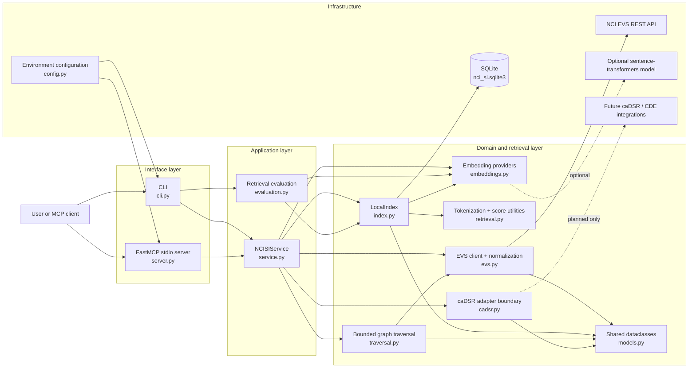
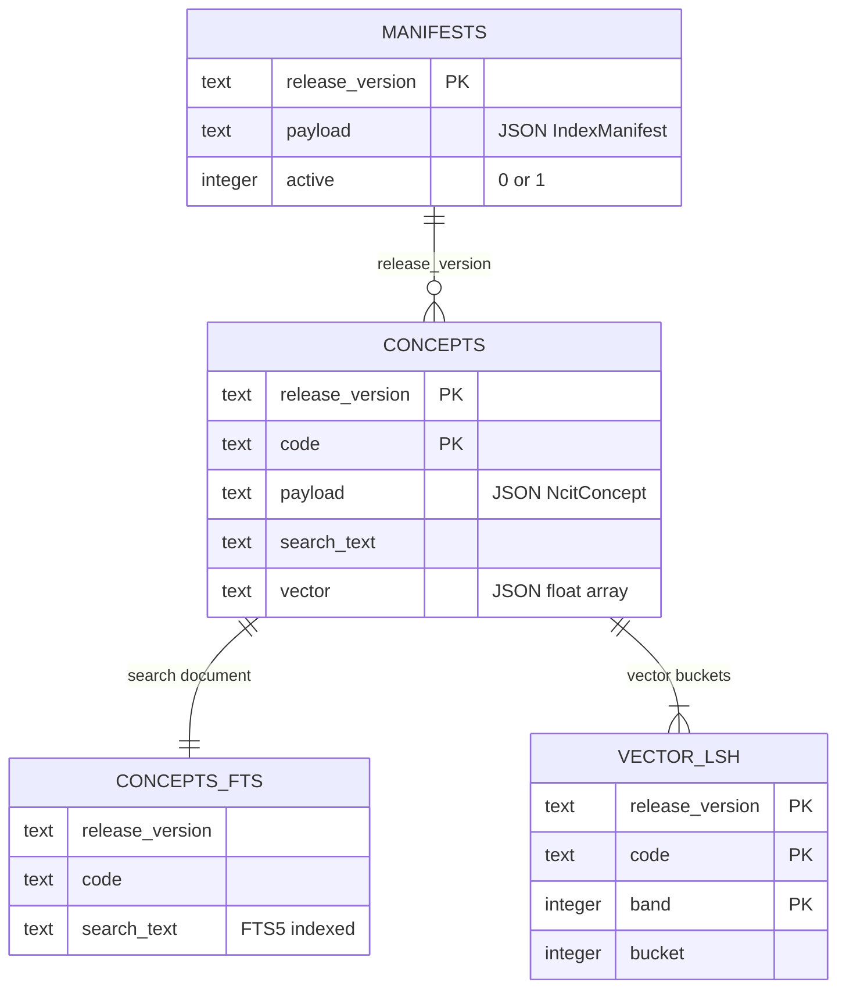

# NCI SI MCP Architecture

This document describes the repository as implemented. The project is an
EVS-first Python prototype that exposes NCI Thesaurus (NCIt) retrieval through
both a command-line interface and a local Model Context Protocol (MCP) server.

## Component schema

## Components

| Component | Responsibility | Main dependencies |
| --- | --- | --- |
| `cli.py` | Defines `serve`, release inspection, sample indexing, search, lookup, traversal, and evaluation commands. | `NCISIService`, `evaluation`, `server` |
| `server.py` | Registers five MCP tools and three MCP resource patterns, then runs FastMCP over stdio. | `NCISIService`, optional `mcp` package |
| `service.py` | Validates inputs, returns shared error envelopes, orchestrates use cases, enforces active-release consistency, and provides live-EVS-to-cache lookup fallback. Its collaborators are injectable for testing. | EVS client, local index, traversal, embeddings, caDSR adapter |
| `evs.py` | Calls EVS REST endpoints with bounded retries and response-size limits, resolves exactly one latest monthly NCIt release, and normalizes EVS payloads. | Python `urllib`, shared models, NCI EVS API |
| `index.py` | Migrates and transactionally maintains release manifests, normalized concepts, FTS search text, vectors, and vector LSH buckets; performs BM25/vector/hybrid search. | SQLite FTS5, retrieval utilities, embedding provider |
| `retrieval.py` | Implements tokenization, cosine similarity, and min-max normalization. | Python standard library |
| `embeddings.py` | Defines the embedding abstraction, a deterministic local hashing provider, and an optional sentence-transformers provider. | Optional `sentence-transformers` package |
| `traversal.py` | Performs breadth-first traversal of hierarchy, role, and association endpoints with direction/filter controls, deduplication, and hard node/edge/depth limits. | EVS client, shared models |
| `models.py` | Defines serializable release, concept, index, search-hit, traversal, and caDSR status dataclasses. | Python standard library |
| `evaluation.py` | Evaluates BM25, vector, and hybrid retrieval against a small built-in gold-query set. | Local index, embedding provider |
| `cadsr.py` | Exposes an explicit `reuse_pending` boundary; no caDSR search or fabricated CDE results are implemented. | Shared models |
| `config.py` | Loads and validates EVS, retry, batching, logging, data-directory, and embedding settings from environment variables. | Environment |
| `validation.py` | Normalizes NCIt codes and validates search and traversal inputs. | Shared errors |
| `errors.py` | Defines compatibility/validation errors and the shared serialized error envelope. | Python standard library |

## Primary flows

### Build a local index

1. `index-sample` enters through the CLI and calls `NCISIService.index_codes`.
2. The service validates and deduplicates the codes, resolves the single latest
   monthly NCIt release, then retrieves concepts from EVS in bounded batches.
3. `LocalIndex` normalizes each concept and verifies the payload release and
   embedding provider/model/dimensions before changing persistent state.
4. Search text, embeddings, FTS rows, vector LSH buckets, and the active manifest
   are committed in one SQLite transaction. A mismatch leaves the prior active
   release untouched.

### Search

1. CLI or MCP calls `NCISIService.search`.
2. `LocalIndex` verifies that the runtime embedding configuration matches the
   active manifest.
3. BM25 candidates come from SQLite FTS5. Vector candidates come from persistent
   LSH buckets and are reranked with exact cosine similarity. Work for an unused
   retrieval mode is skipped.
4. Scores are normalized and selected as BM25, vector, or a
   `0.55 * BM25 + 0.45 * vector` hybrid score.
5. Ranked `SearchHit` objects are returned with raw EVS payloads hidden unless
   explicitly requested.

### Lookup

1. The service resolves the current monthly release and requests the concept
   from live EVS.
2. If EVS metadata or concept lookup fails, lookup falls back to the active
   SQLite cache unless `live_only` is set.
3. If live EVS and the active index report different releases, the service fails
   closed unless `live_only` is set, preventing mixed-release responses.

### Traverse

1. The service resolves the monthly release and calls `traverse_ncit`.
2. Traversal maps hierarchy, role, and association types to EVS relationship
   endpoints, then runs a breadth-first search.
3. Direction, relationship-name, and edge-type filters are applied. Requested
   limits are clamped to a maximum depth of 4, 1,000 nodes, and 5,000 edges.
4. Nodes and edges are deduplicated, every emitted edge references an emitted
   node, and the result reports whether it was truncated.

## Persistence schema

SQLite is used as a release-aware cache and compact local index. The database
does not declare a foreign key, but `release_version` is the logical relationship
between the tables. `PRAGMA user_version` drives migrations, and a partial unique
index guarantees that at most one manifest is active.

## Public surface

MCP tools:

- `ncit_search`
- `ncit_lookup`
- `ncit_traverse`
- `ncit_release_info`
- `cadsr_status`

MCP resources:

- `nci-si://concept/ncit/{code}`
- `nci-si://release/ncit/{version}`
- `nci-si://index/ncit/{version}/manifest`

The CLI additionally exposes sample indexing and retrieval evaluation, which are
not MCP tools.

## Current boundaries

- NCIt is the only implemented terminology path.
- Search is local and requires an active index; the EVS client's remote search
  method is not used by the service.
- Traversal is live against EVS rather than cached in SQLite.
- The dependency-free vector index uses approximate LSH candidate selection. A
  specialized ANN engine may provide better recall/latency at very large scale.
- caDSR/CDE discovery is a status-only adapter until reusable APIs, credentials,
  schemas, indexes, models, and ranking rules are confirmed.
- Indexing is manual by supplied codes; there is no complete NCIt-universe build
  workflow even though the EVS client can list codes.
- The MCP dependency requires Python 3.10+, while the core CLI and tests support
  Python 3.9+.

## Verification map

- `tests/test_evs.py`: monthly-release selection and concept provenance.
- `tests/test_evs_client.py`: retries, status-aware failure, and response limits.
- `tests/test_index.py`: migrations, FTS/LSH persistence, compatibility, and ranking.
- `tests/test_service.py`: dependency injection, errors, batching, fallback, and release integrity.
- `tests/test_traversal.py`: node/edge/depth caps, graph integrity, and filtering.
- `tests/test_validation.py`: public input and embedding configuration validation.
- `tests/test_cli.py` and `tests/test_server.py`: adapter wiring and server smoke coverage.
