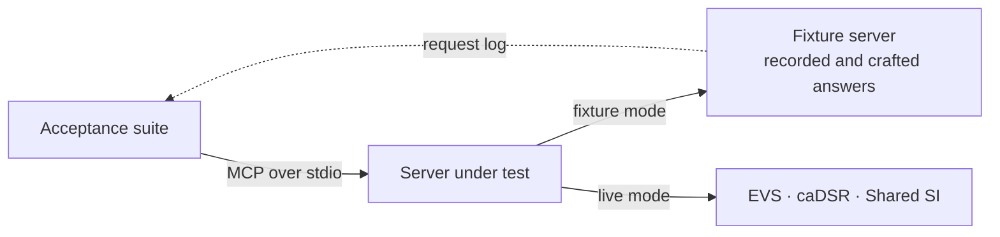

# NCI SI MCP

[](https://github.com/hniedner/nci-si-mcp/actions/workflows/ci.yml)
[](LICENSE)
[](pyproject.toml)

The government-furnished prototype of the Model Context Protocol (MCP) server for the NCI
Semantic Infrastructure, and the acceptance suite it and its successors are measured by. Two
Statements of Work build on it: *EVS SOW v2.1* (terminology: NCI Thesaurus through EVS) and
*caDSR SOW v1.1* (metadata: common data elements through caDSR), with the cross-domain tools that
join them. It is a prototype, not a production service, and it never returns caDSR content it
did not retrieve.

## Try it

```bash
pdm install                  # Python 3.14+ and PDM
pdm run nci-si-mcp serve     # the server, over MCP stdio
pdm run acceptance           # the acceptance suite against it, on recorded upstream answers
```

[QUICKSTART.md](QUICKSTART.md) has the rest: connecting a client, settings, tools and errors.

## How the pieces fit



The suite tests the MCP tool surface of whatever server it starts, against fixtures or the live
services; it knows nothing of the server's code.

## Status

The [specification](docs/specification.md) names 29 tools in four groups.

<!-- acceptance-status:begin -->
Fixture-mode outcome of each tool, from the expected outcomes of the 939 tests of the acceptance suite ([acceptance/expected/fixture.json](acceptance/expected/fixture.json)); [acceptance/README.md](acceptance/README.md#the-report) defines the outcomes. This table is generated by `pdm run acceptance-status`.

| Group | Tools | Outcome of each tool |
|---|---|---|
| EVS tools | 12 | FAIL: `resolve_release`, `get_concept`, `get_concepts`, `search_concepts`, `get_concept_hierarchy`, `get_concept_neighborhood`, `get_concept_subsets`, `get_concept_mappings`, `resolve_retired_code`, `list_relationships`, `list_terminologies`<br>NOT IMPLEMENTED: `expand_value_set` |
| caDSR tools | 10 | NOT IMPLEMENTED: `resolve_registry_release`, `get_data_element`, `search_data_elements`, `match_data_elements`, `match_value_meanings`, `get_form`, `get_permissible_value`, `get_code_map`, `list_contexts`, `list_classification_schemes` |
| Cross-domain tools | 4 | NOT IMPLEMENTED: `find_data_elements_for_concept`, `get_concept_for_permissible_value`, `resolve_stored_value`, `get_release_alignment` |
| Workflow tools | 3 | NOT IMPLEMENTED: `ground_value`, `expand_cohort`, `harmonize_data_dictionary` |
<!-- acceptance-status:end -->

The acceptance suite comes first (Phase 0): its mechanics and the EVS fixture set are in place,
and the tests of each group follow. The
[milestones](https://github.com/hniedner/nci-si-mcp/milestones) track the phases.

## Start here

- **The EVS, caDSR and Shared SI teams**: [docs/specification.md](docs/specification.md) specifies the
  required tools and their behaviour (rendered from `spec/`); [docs/implementation-plan.md](docs/implementation-plan.md) plans
  the work, phase by phase;
  [acceptance/README.md](acceptance/README.md) runs the suite against your server and renders the
  per-tool report; the upstream requests the tools rest on, each with its operation and
  rationale, are listed for [EVS](acceptance/request-forms/evs.md), for
  [caDSR](acceptance/request-forms/cadsr.md), for the
  [Shared SI Service](acceptance/request-forms/ssis.md) and for [all](acceptance/request-forms/all.md).
- **NCI reviewers and the suite's maintainers**: [acceptance/README.md](acceptance/README.md) and
  [acceptance/fixtures/README.md](acceptance/fixtures/README.md), where the fixtures come from.
- **Working on this repository**: [CONTRIBUTING.md](CONTRIBUTING.md) for the commands, standards
  and gates; [ARCHITECTURE.md](ARCHITECTURE.md) for how the server is built.

## License

[Apache License 2.0](LICENSE). The recorded NCI Thesaurus content in the fixtures is under its own
terms, stated in [acceptance/fixtures/README.md](acceptance/fixtures/README.md).
