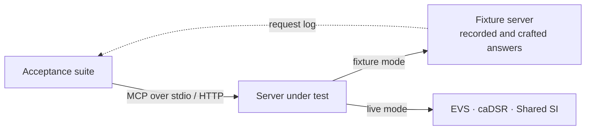

# NCI SI MCP

[](https://github.com/CBIIT/nci-si-mcp/actions/workflows/ci.yml?query=branch%3Amain)
[](https://github.com/CBIIT/nci-si-mcp/actions/workflows/github-code-scanning/codeql?query=branch%3Amain)
[](https://github.com/CBIIT/nci-si-mcp/blob/coverage-badges/provenance.json)
[](https://github.com/CBIIT/nci-si-mcp/blob/coverage-badges/provenance.json)
[](LICENSE)
[](pyproject.toml)

CI and CodeQL badges track `main`. Coverage badges show combined line and branch coverage
from successful main CI, with the measured commit and run linked; they are not acceptance pass rates.

The government-furnished prototype of the Model Context Protocol (MCP) server for the NCI
Semantic Infrastructure, and the acceptance suite it and its successors are measured by. Two
Statements of Work build on it: *EVS SOW v2.1* (terminology: NCI Thesaurus through EVS) and
*caDSR SOW v1.1* (metadata: common data elements through caDSR), with the cross-domain tools that
join them. It is a prototype, not a production service, and it never returns caDSR content it
did not retrieve.

## Try it

```bash
pdm install                  # Python 3.14+ and PDM
pdm run nci-si-mcp serve     # the server, over MCP stdio
pdm run acceptance           # the acceptance suite against it, on recorded upstream answers
```

[QUICKSTART.md](QUICKSTART.md) has the rest: connecting a client, settings, tools and errors.

## How the pieces fit



The suite tests the MCP tool surface of a server it starts or connects to, against fixtures or
the live services; it knows nothing of the server's code.

[Architecture diagrams](ARCHITECTURE.md) cover system context, components, request flow,
index lifecycle and data. [Deployment diagrams](docs/deployment.md) show local stdio, local
containers and the proposed Cloud One layout.

[Behavioural test stories](docs/behavioural-tests.md) document every MCP acceptance case,
grouped by user goal, with expected answers, failure cases and links to executable evidence.

## Status

The [specification](docs/specification.md) names 29 tools in four groups.

<!-- acceptance-status:begin -->
Fixture-mode outcome of each tool, from the expected outcomes of the 964 tests of the acceptance suite ([acceptance/expected/fixture.json](acceptance/expected/fixture.json)); [acceptance/README.md](acceptance/README.md#the-report) defines the outcomes. This table is generated by `pdm run acceptance-status`.

| Group | Tools | Outcome of each tool |
|---|---|---|
| EVS tools | 12 | PASS: `resolve_release`, `get_concept`, `get_concepts`, `search_concepts`, `get_concept_hierarchy`, `expand_value_set`, `get_concept_neighborhood`, `get_concept_subsets`, `get_concept_mappings`, `resolve_retired_code`, `list_relationships`, `list_terminologies` |
| caDSR tools | 10 | PASS: `resolve_registry_release`, `get_data_element`, `search_data_elements`, `match_data_elements`, `match_value_meanings`, `get_form`, `get_permissible_value`, `get_code_map`, `list_contexts`, `list_classification_schemes` |
| Cross-domain tools | 4 | PASS: `find_data_elements_for_concept`, `get_concept_for_permissible_value`, `resolve_stored_value`, `get_release_alignment` |
| Workflow tools | 3 | PASS: `ground_value`, `expand_cohort`, `harmonize_data_dictionary` |
<!-- acceptance-status:end -->

Portable [caller permissions](docs/caller-permissions.md) and the
[required-auth HTTP entry point](docs/governed-http.md) provide private responses and per-request
policy checks. The default remains trusted-local; production
identity-provider integration is not enabled.

The [assisted-task evaluation](docs/assisted-evaluation.md) measures deterministic
fixture workflows. Internal `ask` orchestration and wxMCP integration are
[deferred to Backlog with research criteria](docs/deferred-capabilities.md); neither is enabled.
The [Phase 6 assurance matrix](docs/phase-6-assurance.md) records compatibility and limitations.

The [validation and benchmark evidence](docs/benchmark.md) separates fixture acceptance,
live protocol coverage and representative live tool measurements. caDSR credentialed content
remains contract-fixture evidence until credentials are issued. The
[milestones](https://github.com/CBIIT/nci-si-mcp/milestones) track the phases.

## Start here

- **The EVS, caDSR and Shared SI teams**: [docs/specification.md](docs/specification.md) specifies the
  required tools and their behaviour (rendered from `spec/`); [docs/implementation-plan.md](docs/implementation-plan.md) plans
  the work, phase by phase;
  [acceptance/README.md](acceptance/README.md) runs the suite against your server and renders the
  per-tool report; the upstream requests the tools rest on, each with its operation and
  rationale, are listed for [EVS](acceptance/request-forms/evs.md), for
  [caDSR](acceptance/request-forms/cadsr.md), for the
  [Shared SI Service](acceptance/request-forms/ssis.md) and for [all](acceptance/request-forms/all.md).
  [Upstream requirements](docs/upstream/README.md) link the remaining platform requests to
  their evidence, affected tests, workarounds and acceptance criteria.
- **NCI reviewers and the suite's maintainers**: [acceptance/README.md](acceptance/README.md) and
  [acceptance/fixtures/README.md](acceptance/fixtures/README.md), where the fixtures come from.
- **Working on this repository**: [CONTRIBUTING.md](CONTRIBUTING.md) for the commands, standards
  and gates; [ARCHITECTURE.md](ARCHITECTURE.md) for how the server is built.

## License

[Apache License 2.0](LICENSE). The recorded NCI Thesaurus content in the fixtures is under its own
terms, stated in [acceptance/fixtures/README.md](acceptance/fixtures/README.md).
