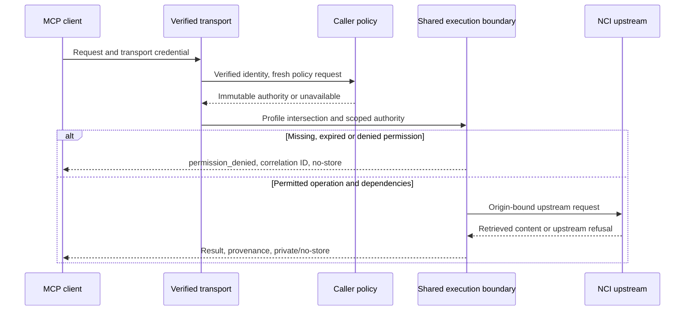

# Caller permissions

Design credit: **Semantic Infrastructure (SI) team**, *MCP Architecture*, SI Team Meeting,
1 October 2026. Implements the portable access decisions in the
[Phase 6 decision record](decisions/001-si-architecture-alignment.md).

The default CLI and stdio server remain trusted-local. Embedders opt into caller policy by
supplying an asynchronous `authority_resolver` to `create_mcp` or `create_http_app`.
Configuring SDK authentication also requires caller policy: missing policy fails closed.
The stock secured entry point and production identity integration are separate work in #178.

The resolver runs for every request and returns an immutable `Authority`: verified
`Principal` (issuer, subject and applicable tenant/client), a set of permitted tool names,
policy version and finite expiry as Unix seconds. It must use an authenticated transport identity,
such as the SDK's verified access token, never tool arguments, `_meta`, a cursor or forwarded
headers. Return `None`, or raise `PolicyUnavailableError`, when current policy is unavailable.
An unknown permission grants nothing. There are no wildcard permissions.

The deployment profile limits the surface; policy can only reduce it. Denied calls return
`permission_denied`, a generic next step and correlation ID. They disclose neither the
restricted identifier nor which permission is missing. Secured tool telemetry hashes all
arguments, including identifiers that unrestricted calls normally record plainly. HTTP authentication and transport
scope failures remain SDK 401/403 responses. Upstream credentials still belong to their
configured origins, and application permission cannot override upstream authorization.

## What a permission grants

Each of the 29 MCP tool names is a permission for that operation's intrinsic reads. Resolving
a release or obtaining metadata required to validate its content does not require an additional
discovery permission. Composition requires the separately exposed producers below; all selected
dependencies are checked before the first read, and reused producers check again before new work.

| Operation | Additional permissions |
| --- | --- |
| `ground_value` | `get_concept`, `find_data_elements_for_concept`; `search_concepts` when `text` is supplied; `resolve_stored_value` when `commons` is supplied; `get_code_map` for a commons other than GDC |
| `expand_cohort` | `get_concept_hierarchy`, `get_concept_neighborhood` |
| `harmonize_data_dictionary` | `match_data_elements`; `match_value_meanings` when nonempty sample values are supplied |
| `get_concept_for_permissible_value` | `get_concept` |
| `resolve_stored_value` | `get_code_map` for a commons other than GDC; GDC mapping reads are intrinsic to this operation |
| Other tools | No additional permissions |

Resource aliases use the same authority, not separate grants:

| Resource | Permission |
| --- | --- |
| `ncit://concept/{release}/{code}` | `get_concept` |
| `ncit://release/{version}` | `resolve_release` |
| `ncit://index/manifest/{release}` | `search_concepts` |
| `cadsr://data-element/{publicId}` and its versioned form | `get_data_element` |
| `cadsr://registry/release` | `resolve_registry_release` |
| `cadsr://crosswalk/crdc` | `get_code_map` |

Each furnished prompt is listed and rendered only when all the tools named in
[`spec/prompts.yaml`](../spec/prompts.yaml) are permitted within the profile. Tool calls made
from that prompt still undergo their own argument-dependent checks. A hidden name or URI
cannot be invoked by guessing it.

## Freshness and isolation

Every new request/page obtains current policy; an in-flight call holds its snapshot, and new
restricted child work checks its expiry. A policy change affects subsequent requests, even in
the same session. The operator must document the resolver's actual revocation freshness before
production enablement. Tests with immediate fixture changes do not establish a production
revocation window. Previously delivered content cannot be recalled.

An HTTP session binds the complete principal identity before using its implicit NCIt release
pin. A different issuer, subject, tenant or client is refused. X-22 otherwise remains unchanged:
explicit calls do not replace the pin; stateless calls resolve per call. Replica ownership and
restart behavior remain as documented in [QUICKSTART](../QUICKSTART.md).

Secured catalogues, content and denials use zero/private MCP hints and HTTP
`Cache-Control: no-store`, including older protocols without native hint fields. There is no
authenticated response cache shared between callers. An index or upstream cache is never an
authorization decision; outward reads are checked again.

