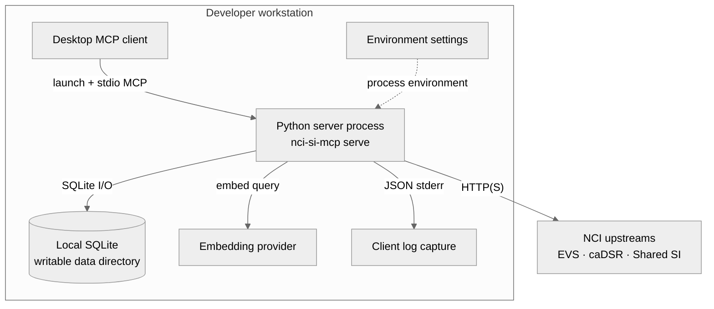
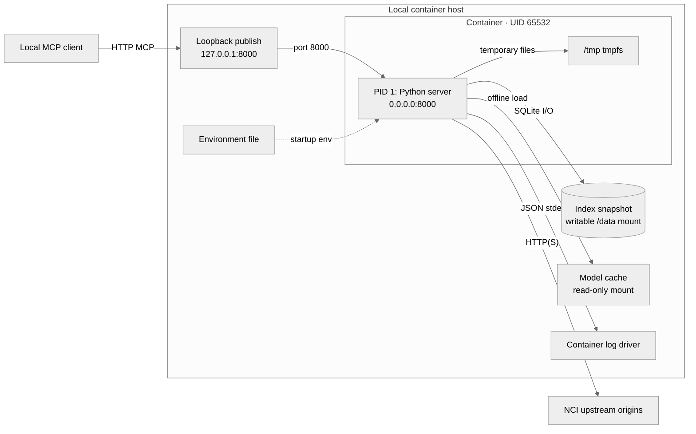
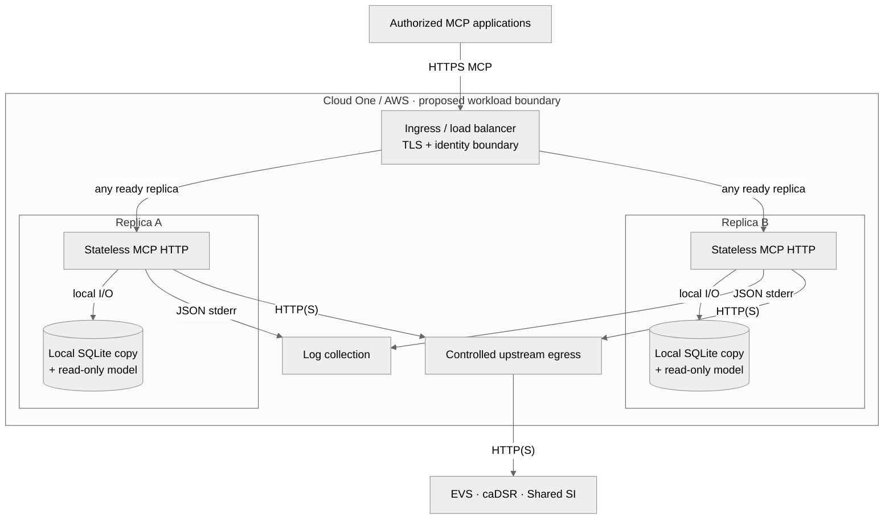

# Deployment views

These diagrams complement the [architecture views](../ARCHITECTURE.md) and the executable
[container runbook](container.md). Local views describe the supported prototype. The Cloud One
view is a **proposed reference layout**, not deployed infrastructure or an approved AWS design.
Solid arrows show calls, reads or output; dashed arrows show operator-supplied configuration
and assets. Labels identify protocols and storage permissions.

## Local stdio

The MCP client launches and owns one server process. No listening HTTP port is required. A
stdio stream can retain its first implicit NCIt release; a one-shot CLI command resolves per
call. A local index is optional for live content tools but required for semantic/hybrid search.

The index is built and evaluated through separate [CLI commands](../QUICKSTART.md#build-a-small-local-index).
Fixture mode redirects upstream requests to the local fixture server; it does not manufacture
successful live caDSR responses. See [client configuration](../QUICKSTART.md#connect-a-client).

## Local container over HTTP

This is the runbook's loopback-only Docker deployment. The image defaults to stateless HTTP
and a required index. It loads an externally supplied model offline, and never builds or
activates an index while serving. The root filesystem is read-only; `/data` and `/tmp` are
writable, and `/model-cache` is mounted read-only. Plain local Python HTTP also works with
`serve --transport streamable-http`; unlike the image, it defaults to stateful sessions and
does not require an index for readiness.

Host/Origin admission applies even on loopback and to health probes. `/health` checks the
process; `/ready` checks local index/model compatibility, not upstream availability. The
default image has no client authentication configured. Keep it private until the approved
identity integration is supplied. Allow 20 seconds for SIGTERM shutdown; commands and mount
requirements are in the [runbook](container.md#start-with-external-assets).

## Cloud One reference layout

The intended hosting environment is NCI CBIIT Cloud One (AWS). The hosting team still chooses
compute/orchestration, network topology, TLS termination, identity integration, secret and
artifact services, and deployment roles. The boxes below specify responsibilities without
selecting ECS, EKS, an AWS identity provider, or a shared filesystem. No such infrastructure
is provisioned by this repository.

Operational constraints apply whichever AWS services implement these boxes:

- **Stage each replica before readiness.** Deploy a verified GHCR image digest, copy the
  prepared index and matching model, and inject settings and secrets through the environment.
  Each process exposes `/mcp`, `/health` and `/ready`; image evidence is attached to its release.
- **Require approved authentication.** Set `NCI_SI_HTTP_AUTH_MODE=required` and install the
  [governed HTTP integration](governed-http.md); absent integration fails before listening.
  The local default remains trusted-local. Configure actual Host/Origin authorities;
  forwarded identity headers never grant access. Production identity is still deferred/off.
- **Stateless replicas are independent.** An omitted NCIt release resolves per call. Name a
  release explicitly when calls must agree across replicas or time. For stateful handshake
  clients, route each session to its owning process; a different replica returns 404.
  [The routing sequence](transport.md#session-routing-sequence) shows that failure and recovery.
- **Serving storage is local to each replica.** Distribute a consistent SQLite backup,
  including the active build and retained predecessor; never share a live writable database
  across replicas over a network filesystem. Preserve the model identity used by the index.
  Build/evaluate/activate in an operator workspace, then roll out matching snapshots and models.
  Rollback activates the predecessor in that workspace and redistributes it. The server does
  not synchronize assets or sessions; an asset rollout can invalidate build-bound cursors.
- **Readiness gates local compatibility.** Probe each replica with an allowed Host header.
  Neither health endpoint guarantees live upstream service, issued caDSR credentials, or
  production retrieval quality. The container smoke uses a test-only model.
- **Publication and deployment remain separate.** The repository publishes verified public
  GHCR images. Cloud One ECR publication, AWS credentials/roles and infrastructure automation
  remain hosting work; this view does not implement or authorize them.
