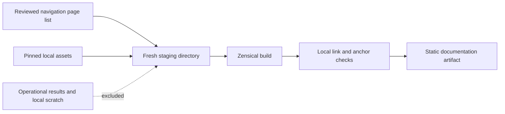

# Public documentation website

The website presents the repository's existing documentation, behavioral stories and Mermaid
diagrams as a searchable static site. It is public, requires no account, and has no connection
to the MCP process or an operational results store. Local use requires no institutional login.
Design credit: the Semantic Infrastructure (SI) team, *MCP Architecture*, 1 October 2026.

## Build and preview

From the repository root, with Python 3.14+, PDM and Node.js/npm installed:

```bash
pdm install -G docs
npm ci --prefix docs/site-assets --ignore-scripts
npm audit --prefix docs/site-assets --audit-level high
pdm run docs-build
pdm run python -m http.server 8000 --bind 127.0.0.1 --directory tmp/docs-site
```

Open `http://127.0.0.1:8000/`. Stop the preview with Ctrl+C. Builds require a new output
directory: for another preview use `pdm run docs-build --output tmp/docs-site-next`, or remove
your previous generated directory after stopping its preview. Existing output is never deleted
by the builder. No GitHub Pages, DNS or cloud settings are changed by these commands.

Zensical is pinned in the docs development group in `pdm.lock`. Mermaid is pinned separately
in `docs/site-assets/package-lock.json`; npm lifecycle scripts are disabled. Neither is a core
MCP runtime dependency. The site serves its diagram runtime, stylesheet, system fonts and
search assets locally; external references remain ordinary links. Repository README badges
become text links in the site, so browsing documentation does not fetch third-party badge images.
Serve the artifact over HTTP; direct `file://` search is not a supported preview mode.

## What can be published



Text alternative: the builder copies only the Markdown pages named in the reviewed navigation
and the explicitly listed assets into fresh staging. Zensical builds that staging; local link
and heading checks must succeed before the output directory is created. Operational results
and scratch files are never copied. Public repository source references remain links to the
source commit, rather than turning the target files into site downloads.

`docs/site-assets/zensical.toml` is both navigation and the page allowlist. Do not replace it
with a recursive copy of `docs/`, test reports, workspaces or mounted data. Tests plant canaries
in excluded Markdown and JSON files and scan **every generated file**, including the search
output, to prevent accidental publication. Approved pages themselves must contain only public
documentation. This is a publication boundary, not a secret detector.

## Version and accessibility

The banner and `build.json` name the source commit, development/release channel and whether
the source tree was modified. Installed package version is recorded separately. A release
label is accepted only with `--release-tag vX.Y.Z` when that tag resolves to the clean source
commit. An installed version alone does not establish a release. Relative navigation and assets
allow the artifact to be mounted at a versioned URL prefix without rebuilding it. The host
supplies error pages; the artifact omits the generator's root-specific 404 page.

Pages retain semantic headings, links and tables in static HTML; essential documentation is
readable without JavaScript. Search and rendered Mermaid diagrams require JavaScript. Diagrams
retain adjacent prose descriptions, and focus outlines and reduced-motion styling support
keyboard navigation. Browser checks cover navigation, search and diagrams; the Phase 7 assurance
issue covers the complete accessibility matrix. This is not a WCAG certification claim.

## Deployment boundary

The documentation artifact can be served by an ordinary static host or a separate companion
container. The local results dashboard, controls and configuration views are separate Phase 7
work. Their UAT/PROD deployment must remain disabled until the platform supplies the approved
authentication and explicit maintainer authorization integration (#197). Documentation remains
anonymous. The repository's public status and upstream EVS/caDSR access controls are unchanged.
